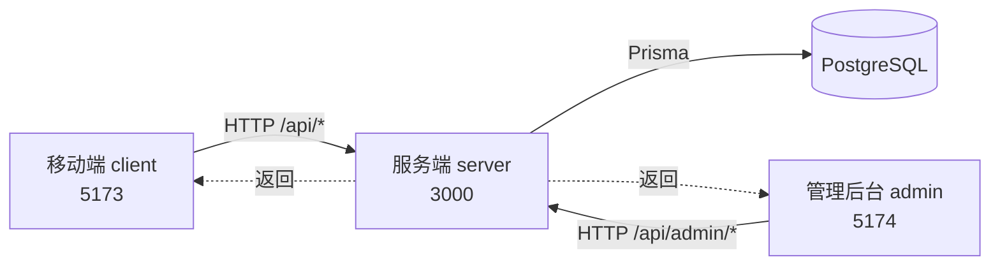

# 01 项目总览

> 三端一体的商城项目：移动端 H5 商城 + 商家管理后台 + 后端 API。本文档库按章节组织，详见 `docs/README.md`。

## 项目定位

- **类型**：单商家商城演示项目
- **目标用户**：买家（移动端 H5）+ 商家运营（管理后台 Web）
- **当前进度**：完成 Phase 1 主体（详见 `summary/admin-roadmap.md`），Phase 2 已预留文档章节编号
- **范围**：演示版。支付、物流、优惠券等流程用 Mock 实现，不接真实第三方

## 三端速览

| 端 | 目录 | 技术栈 | 端口 | 默认账号 |
| --- | --- | --- | --- | --- |
| 移动端 | `client/` | Vue 3.5 + Vite + TS + Vue Router + Pinia + Vant 5 | `5173` | alice / user123 |
| 管理后台 | `admin/` | Vue 3.5 + Vite + TS + Vue Router + Pinia + Element Plus + ECharts | `5174` | admin / admin123 |
| 服务端 | `server/` | NestJS 12 + Prisma 6 + PostgreSQL | `3000` | — |

## 技术栈一览

### 客户端 / 后台共用

- **框架**：Vue 3.5 Composition API
- **构建**：Vite 5
- **类型**：TypeScript
- **路由**：Vue Router 4（history 模式）
- **状态**：Pinia（含 `pinia-plugin-persistedstate` 本地持久化）
- **HTTP**：`ofetch.create` 统一封装，Token 自动注入
- **目录别名**：`@` → `src/`

### 移动端专属

- **UI**：Vant 5（`@vant/auto-import-resolver` 按需引入）
- **样式单位**：px（移动端不引入 rem）

### 管理后台专属

- **UI**：Element Plus（含 `@element-plus/icons-vue` 全量注册）
- **图表**：ECharts 5（仪表盘销售趋势折线图）
- **国际化**：Element Plus locale 设为 `zh-cn`
- **主题**：浅色 / 深色 / 跟随系统三态切换（`stores/theme.ts`）

### 服务端

- **框架**：NestJS 12
- **ORM**：Prisma 6（`@prisma/client`）
- **数据库**：PostgreSQL
- **认证**：`@nestjs/jwt`（两套独立 secret，前台与后台互不干扰）
- **校验**：`class-validator` + `class-transformer` 全局 `ValidationPipe`
- **安全**：`helmet` 默认中间件
- **跨域**：通过 `CORS_ORIGINS` 环境变量配置允许的 origin

## 三端协作关系

- 移动端只走 `/api/*`（不含 `/admin`），由 `client/src/api/request.ts` 的 `baseURL = '/api'` 决定
- 管理后台只走 `/api/admin/*`，由 `admin/src/api/request.ts` 的 `baseURL = '/api/admin'` 决定
- 两者通过 `Vite Proxy` 转发到 `http://localhost:3000`，开发期无需处理 CORS
- 服务端全局前缀由 `main.ts` 的 `app.setGlobalPrefix('api')` 设置

## 默认账号清单

> 来源：`server/prisma/seed.ts`

### 管理后台

| 用户名 | 密码 | 角色 | 权限 |
| --- | --- | --- | --- |
| `admin` | `admin123` | `SUPER_ADMIN` | 所有权限（含 `*` 通配） |
| `operator` | `admin123` | `ADMIN` | 日常运营权限（不含删除、角色分配） |

### 移动端

| 用户名 | 密码 | 说明 |
| --- | --- | --- |
| `alice` | `user123` | 昵称：小爱 |
| `bob` | `user123` | 昵称：阿波 |
| `carol` | `user123` | 昵称：小卡 |
| `dave` | `user123` | 昵称：老戴 |
| `eve` | `user123` | 昵称：伊芙 |

> ⚠️ 演示用默认账号密码固定，**正式上线前必须修改**。详见 `02-快速开始.md` 与 `04-开发约定与常见问题.md`。

## 项目文档导航

- 三端协作图、目录结构、数据流：见 `03-架构与目录结构.md`
- 三端启动命令、环境变量、Seed：见 `02-快速开始.md`
- 服务端模块 / 数据表 / 接口：见 `10-服务端/`
- 管理后台各模块：见 `20-管理后台/`
- 移动端各模块：见 `30-移动端/`
