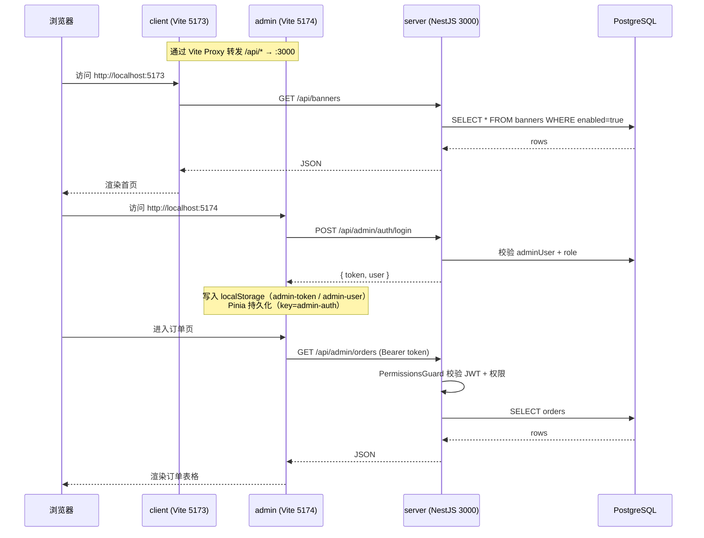

# 03 架构与目录结构

> 本文档讲清楚两个问题：仓库怎么组织、三端如何协作。

## 1. 顶层目录

```
mymobilepage/
├── client/        移动端 H5 商城（Vue 3 + Vant 5）
├── admin/         管理后台（Vue 3 + Element Plus）
├── server/        后端 API（NestJS + Prisma + PostgreSQL）
├── docs/          本文档库
├── summary/       路线图 / 进度记录 / 测试记录
├── README.md      项目根级介绍
└── package.json   npm workspaces 根配置
```

`summary/` 目录存放项目过程文档（路线图、迭代记录、问题排查）。不属于代码，仅供回溯。

## 2. npm Workspaces

根 `package.json`：

```json
{
  "workspaces": ["client", "server", "admin"],
  "scripts": {
    "dev:client":  "npm run dev -w client",
    "dev:admin":   "npm run dev -w admin",
    "dev:server":  "npm run start:dev -w server",
    ...
  }
}
```

含义：

- `npm install` 在根目录一次装齐所有子项目依赖，`node_modules` 提到根
- `-w <pkg>` 限定脚本在哪个子项目跑，避免来回 `cd`
- 子项目之间通过相对路径互相引用（如 `client` 通过 Vite Proxy 调 `server`）

## 3. 三端目录结构

### `client/` 移动端

```
client/
├── src/
│   ├── api/                HTTP 封装（ofetch + 各资源 api 文件）
│   │   ├── request.ts      公共 ofetch 实例（baseURL = '/api'）
│   │   ├── auth.ts         /auth/login、/auth/logout
│   │   ├── banner.ts       /banners（GET 公开）
│   │   ├── product.ts      /categories、/products
│   │   └── order.ts        /orders（创建 / 我的 / 详情 / 取消 / 确认收货）
│   ├── layouts/            框架布局
│   │   └── TabBarLayout.vue   底部 Tab 容器
│   ├── router/             路由表 + 全局前置守卫
│   ├── stores/             Pinia store
│   │   ├── user.ts         登录态 + 用户信息（localStorage 持久化）
│   │   └── cart.ts         购物车（localStorage 持久化，不入库）
│   ├── views/              10 个页面组件（详见 30-移动端/02-路由与页面结构.md）
│   ├── styles/             全局样式（main.css）
│   ├── types/              自动生成 + 组件类型声明
│   ├── App.vue
│   └── main.ts             应用入口（Pinia + Router 挂载）
├── public/
├── index.html
├── vite.config.ts          端口 5173 + /api 代理
└── package.json
```

### `admin/` 管理后台

```
admin/
├── src/
│   ├── api/                HTTP 封装（baseURL = '/api/admin'）
│   │   ├── request.ts      自动注入 admin-token
│   │   ├── admin-auth.ts   /admin/auth/{login,logout,profile}
│   │   ├── admin-dashboard.ts  /admin/dashboard/{overview,sales-trend}
│   │   ├── admin-users.ts
│   │   ├── admin-products.ts
│   │   ├── admin-categories.ts
│   │   ├── admin-orders.ts
│   │   ├── admin-banners.ts
│   │   └── admin-announcements.ts
│   ├── directives/
│   │   └── permission.ts   v-permission 自定义指令
│   ├── layouts/
│   │   └── AdminLayout.vue 左侧菜单 + 顶栏 + 主题切换
│   ├── router/             路由表 + meta.permission 校验
│   ├── stores/
│   │   ├── admin-auth.ts   token + 当前管理员 + 权限判定（persistedstate）
│   │   └── theme.ts        浅色 / 深色 / 跟随系统
│   ├── views/              8 个页面组件
│   │   ├── LoginView.vue
│   │   ├── DashboardView.vue
│   │   ├── UserListView.vue
│   │   ├── CategoryListView.vue
│   │   ├── ProductListView.vue
│   │   ├── OrderListView.vue
│   │   ├── BannerListView.vue
│   │   └── AnnouncementListView.vue
│   ├── styles/             全局样式
│   ├── types/              components.d.ts / auto-imports.d.ts
│   ├── App.vue
│   └── main.ts             入口：Pinia + 持久化 + ElementPlus + Icons + 权限指令
└── vite.config.ts          端口 5174 + /api 代理
```

### `server/` 服务端

```
server/
├── prisma/
│   ├── schema.prisma              10 张表的模型定义
│   ├── seed.ts                    初始数据脚本
│   └── migrations/                迁移历史
│       ├── 20260911055156_init/                       初始迁移
│       └── 20260911063637_phase1_admin_and_orders/   Phase 1 增量
├── src/
│   ├── main.ts                    入口：helmet + CORS + ValidationPipe + 全局过滤器
│   ├── app.module.ts              根模块，注册 14 个业务模块
│   ├── prisma/                    PrismaService 全局单例
│   ├── common/                    通用 dto / filters
│   ├── auth/                      移动端 JWT（passport-jwt）
│   ├── users/                     移动端用户接口（暂只有 service）
│   ├── categories/                移动端公开分类接口
│   ├── products/                  移动端公开商品接口
│   ├── client-banners/            移动端轮播图（GET 公开）
│   ├── client-orders/             移动端订单接口（@UseGuards(JwtAuthGuard)）
│   ├── admin-auth/                后台登录 + PermissionsGuard + JWT 直验
│   ├── admin-users/               后台用户管理
│   ├── admin-categories/          后台分类管理
│   ├── admin-products/            后台商品管理
│   ├── admin-banners/             后台轮播图管理
│   ├── admin-announcements/       后台公告管理
│   ├── admin-orders/              后台订单管理（含状态机）
│   └── admin-dashboard/           后台仪表盘聚合接口
└── package.json
```

## 4. 三端协作数据流



关键点：

- 客户端 / 后台 / 服务端**完全独立部署**（Vite dev server 与 NestJS 进程分离）
- 服务端全局前缀 `/api`，后台模块路径前缀再加 `/admin`，形成 `/api/admin/*` 与 `/api/*` 两套命名空间
- Vite Proxy 仅在开发期使用；生产期由 Nginx 等反向代理替代

## 5. 模块清单速览

### 服务端 14 个模块（详见 `10-服务端/02-模块总览.md`）

- **基础**：`PrismaModule`（全局）、`ConfigModule`（全局）
- **公共**：`AuthModule`（前台 JWT）、`UsersModule`（前台）
- **客户端公开**：`CategoriesModule`、`ProductsModule`、`ClientBannersModule`
- **客户端登录后**：`ClientOrdersModule`（JwtAuthGuard）
- **后台**：`AdminAuthModule`、`AdminUsersModule`、`AdminCategoriesModule`、`AdminProductsModule`、`AdminBannersModule`、`AdminAnnouncementsModule`、`AdminOrdersModule`、`AdminDashboardModule`

### 管理后台 8 个页面（详见 `20-管理后台/`）

- 登录 / 仪表盘 / 用户 / 分类 / 商品 / 订单 / 轮播图 / 公告

### 移动端 10 个页面（详见 `30-移动端/02-路由与页面结构.md`）

- 登录 / 首页（Tab）/ 分类（Tab）/ 购物车（Tab）/ 我的（Tab）/ 商品详情 / 订单确认 / 下单成功 / 我的订单 / 订单详情

## 6. 数据库表一览

> 完整字段与 ER 图见 `10-服务端/03-数据库Schema说明.md`

| 表 | 用途 | Phase |
| --- | --- | --- |
| `users` | 前台买家 | 初始 |
| `admin_users` | 后台管理员 | 1 |
| `admin_roles` | 后台角色 + 权限码 | 1 |
| `categories` | 商品分类 | 初始 |
| `products` | 商品 | 初始 |
| `banners` | 首页轮播图 | 初始 |
| `announcements` | 首页公告 | 1 |
| `orders` | 订单 | 1 |
| `order_items` | 订单商品快照 | 1 |
| `refund_requests` | 退款申请（Phase 2 用 UI） | 1（先建表） |

## 7. 路径前缀约定

| 前缀 | 含义 |
| --- | --- |
| `/api/*` | 所有对外接口（客户端 + 服务端共用命名空间） |
| `/api/admin/*` | 后台管理接口（额外要求 `PermissionsGuard` 校验） |
| `/api/orders`、`/api/products`、`/api/categories`、`/api/banners` | 客户端公开接口 |
| `/api/auth/*` | 前台登录 / 注册 / 个人信息 |

服务端通过以下方式实现命名空间隔离：

```ts
// server/src/main.ts
app.setGlobalPrefix('api')

// 客户端控制器
@Controller('orders')        // → /api/orders

// 后台控制器
@Controller('admin/orders')  // → /api/admin/orders
```

`PermissionsGuard` 仅对 `req.path.startsWith('/api/admin')` 生效（详见 `10-服务端/04-认证与权限体系.md`），因此前台公开接口不会被该守卫拦截。
