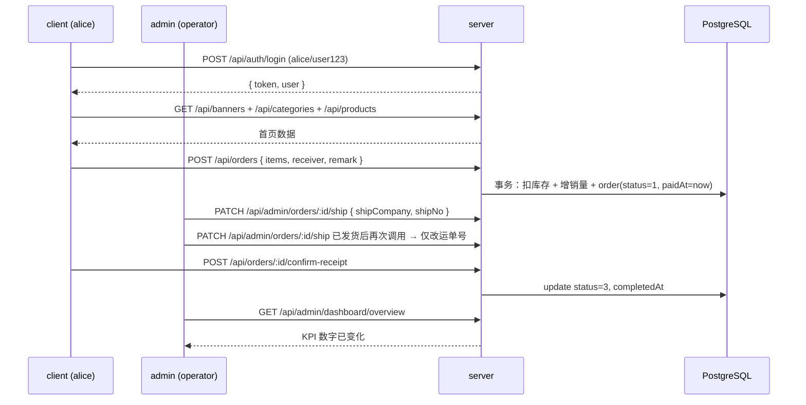
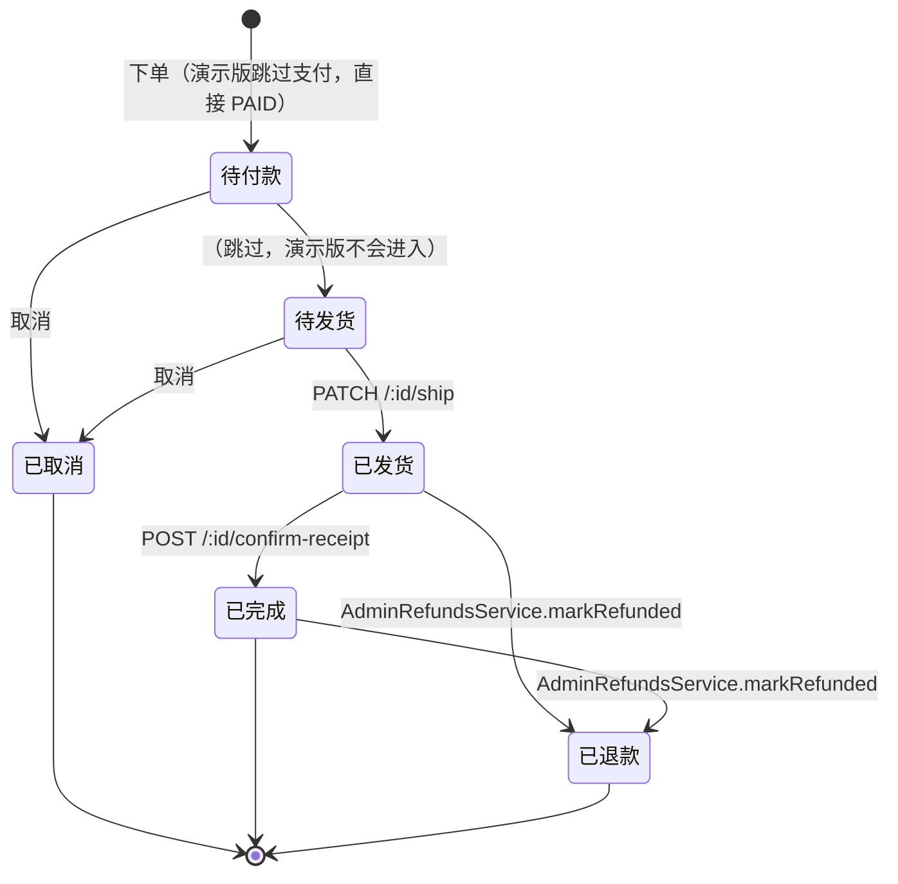

# 测试说明（手动验收脚本）

> 对照 `docs/` 与代码整理的端到端手动验收清单，覆盖 Phase 1 + Phase 2 全部 7 个模块。
> 配套说明：`docs/00-总览与入门/02-快速开始.md`（启动）、`docs/40-部署与运维/04-上线检查清单.md`（上线前）。
>
> 适用范围：演示版完整闭环跑通；生产化前必改项见 README「已知坑位」。

## 1. 前置准备

### 1.1 环境与依赖

| 工具 | 版本要求 | 说明 |
| --- | --- | --- |
| Node.js | `>= 20`（根 `package.json` 的 `engines`） | npm 与 Node 一致 |
| PostgreSQL | `>= 13` | Prisma `provider = "postgresql"` |
| 浏览器 | Chrome / Edge 最新版 | 调试三端 |

### 1.2 一次性安装

```bash
# 根目录一次性装齐 client / admin / server 依赖（npm workspaces）
npm install

# 服务端：生成 Prisma Client + 应用迁移
npm run prisma:migrate

# 写入初始数据（6 分类 + 24 商品 + 5 用户 + 10 单 + 11 评价 + 14 审计 + 12 设置）
npm run prisma:seed
```

> Seed **会先清空所有业务表再重写**，操作前请备份；详见 `docs/10-服务端/06-数据迁移与Seed脚本.md` §6。

### 1.3 三个终端分别启动

```bash
# 终端 A
npm run dev:server   # http://localhost:3000/api
# 终端 B
npm run dev:admin    # http://localhost:5174
# 终端 C
npm run dev:client   # http://localhost:5173
```

端口与代理：

| 端 | Vite 端口 | 后端代理 |
| --- | --- | --- |
| `client/` | 5173 | `/api/*` → `:3000` |
| `admin/` | 5174 | `/api/*` → `:3000` |
| `server/` | 3000 | — |

### 1.4 启动后冒烟（健康检查）

```bash
# 后端存活（无 Token 应返回 401）
curl -i http://localhost:3000/api/admin/dashboard/overview
# → HTTP/1.1 401

# 前端代理：dev:client 起好后访问
curl -i http://localhost:5173/api/banners   # → 200 + JSON 数组
```

浏览器打开 `http://localhost:5174/` 应自动跳到 `/login`，看到 Element Plus 登录表单。

### 1.5 类型检查 + 构建（任一项失败不能合并）

```bash
npm run type-check:client
npm run type-check:admin
npm run type-check:server

npm run build:client
npm run build:admin
npm run build:server
```

## 2. 测试账号（已 seed）

### 2.1 前台用户（`client/`，密码统一 `user123`）

| 用户名 | 昵称 | 手机号 | 用途 |
| --- | --- | --- | --- |
| `alice` | 小爱 | 13800000001 | 主流程演示账号 |
| `bob` | 阿波 | 13800000002 | 备用 |
| `carol` | 小卡 | 13800000003 | 备用 |
| `dave` | 老戴 | 13800000004 | 备用 |
| `eve` | 伊芙 | 13800000005 | 备用 |

### 2.2 后台账号（`admin/`，密码统一 `admin123`）

| 用户名 | 角色 | 权限范围 |
| --- | --- | --- |
| `admin` | `SUPER_ADMIN` | 全部（含 `*` 通配） |
| `operator` | `ADMIN` | 列表 / 详情 / 发货 / 审批 / 导出 等共 41 条；不含 `order:cancel` / `category:delete` / `product:delete` / `banner:delete` / `announcement:publish` / `announcement:delete` / `user:edit` |

完整权限码见 `docs/00-总览与入门/04-开发约定与常见问题.md` §4。

> ⚠️ Seed 密码全部硬编码，**正式上线前必须修改 seed 脚本或删除默认账号**（AGENTS.md §7 #1）。

## 3. 端到端 happy path（主流程）

完整覆盖订单生命周期 + 仪表盘聚合，验证三端串联。



### 3.1 客户端（`alice / user123`）

1. 打开 `http://localhost:5173/`，未登录会被守卫跳到 `/login`
2. 输入 `alice / user123` → 提交 → 跳 `/home`
3. 首页应能看到：3 张轮播图 + 6 个分类 + 商品瀑布流（默认 10 条 / 页）
4. 点商品 → `/product/:id` → 看到封面 / 价格 / 销量 / 库存 / 描述
5. 二选一：
   - 「加入购物车」→ 购物车 Tab 看到该商品
   - 「立即购买」→ 直跳 `/order/confirm?productId=...&quantity=1`
6. 走「加入购物车」路径：购物车 → 勾选 → 「结算」→ `/order/confirm`
7. 填收货人（姓名 / 手机 / 地址，必填）+ 备注（可选）→ 「提交订单」
8. 跳 `/order/success?id=<orderNo>`，点「查看订单」
9. `/order/detail?id=<id>`：状态 = `待发货 (1)`
10. 等运营操作发货后刷新本页：状态 = `已发货 (2)`，底部出现「确认收货」
11. 点「确认收货」 → `showConfirmDialog` 二次确认 → 状态 = `已完成 (3)`

### 3.2 后台（`operator / admin123`，不含 `*` 通配）

1. 打开 `http://localhost:5174/`，跳 `/login`
2. `operator / admin123` 登录 → 跳 `/dashboard`
3. 顶 KPI：今日订单数 / 今日 GMV / 总用户数 / 待处理订单；折线图（默认 7 天 GMV） + 热销 Top10 + 待处理订单 Top5
4. 左侧菜单依次可见 13 项；**看不到「退款审批」** 之外无被隐藏项（`v-permission` 自动过滤）
5. 「订单管理」→ 看到 alice 那笔新单（status=1）
6. 行操作 → 「详情」Drawer 展开（订单号 / 收货人 / 商品快照 / 状态流转时间）
7. 「发货」Dialog：填物流公司 + 物流单号 → 提交
8. 切到「已发货」Tab 验证；可再次「发货」改运单号（不改状态）
9. 切回「仪表盘」 → KPI 数字 / 折线 / Top10 已跟随变化

### 3.3 二次验证（可选）

- 切到 `admin / admin123`：左侧菜单 / 按钮均出现（含 `order:cancel` 等被 `v-permission` 隐藏的按钮），用于对照 SUPER_ADMIN 权限
- 操作日志：Alice 的下单 / Operator 的发货 / 确认收货，均应被 `AuditInterceptor` 自动记录在「操作日志」页

## 4. Phase 1 各模块验证

所有接口路径均带 `/api/admin` 前缀；权限码挂不上会直接 403。

### 4.1 用户管理

| 路径 | 用例 | 期望 |
| --- | --- | --- |
| `/users` | 关键字搜 `alice` | 命中 1 行 |
| `/users` | 状态筛选 `禁用` | 仅显示 `status=0` 用户 |
| 详情 Drawer | 点 alice | 看到基本信息 + 历史订单数（`_count.orders`） |
| 启/禁用切换 | `admin` 账号将 `eve` 改为禁用 | 列表状态变化；`eve` 在 client 端登录被 `AuthService.login` 拒绝（`ForbiddenException`） |

### 4.2 分类管理

| 用例 | 期望 |
| --- | --- |
| 新增分类 | 列表新增 + 排序（`sort`）字段生效 |
| 上移 / 下移 | 排序号变化，列表重排 |
| 删除有商品的分类 | 抛 `ConflictException`（`AdminCategoriesService.remove` 保护） |
| 删除空分类 | 成功 |

### 4.3 商品管理

| 用例 | 期望 |
| --- | --- |
| 上下架开关 | `PATCH /:id/status` 同步；client 商品详情可见性随之变化 |
| 库存调整 | `PATCH /:id/stock` 写入；库存预警 / 流水被记录 |
| 删除 | SUPER_ADMIN 才能成功（`product:delete` 权限） |
| 列表筛选 | 分类 + 状态 + 价格区间联动正确 |

### 4.4 订单管理（重点）

完整状态机：



| 用例 | 期望 |
| --- | --- |
| 关键字 = 数字 | 解释为 `Order.id` 精确匹配 |
| 关键字 = 文本 | `user.username` `contains` 模糊匹配 |
| 跨级跳（如 1 → 3） | 400「订单状态不允许从 1 切换到 3」 |
| 关键字搜索输入中文 / 特殊字符 | URL 编码后命中无异常 |
| Drawer 收货人反序列化 | `{ name, phone, address }` 字段全部展示 |
| 详情含 `refund` | 已有退款申请时 Drawer 显示「退款信息」卡 |

### 4.5 轮播图 / 公告

- 轮播图：`enabled=false` 后 client 首页不展示
- 公告：发布 / 草稿状态切换，client 首页公告条按 `publishedAt desc` 排序

## 5. Phase 2 各模块验证

### 5.1 优惠券（client + admin）

**Seed 已写若干张券**，含满减 / 折扣两种。

| 用例（client） | 期望 |
| --- | --- |
| `/coupons` 领券中心「可用」Tab | 看到可领券列表，点「立即领取」调用 `POST /api/coupons/claim` |
| 「我的」Tab | 展示已领券 + 状态（未使用 / 已使用 / 已过期） |
| 下单选券 → `POST /api/coupons/preview` | 返回 `{ originalAmount, discountAmount, totalAmount }`，「提交订单」后订单带 `originalAmount / discountAmount`，券状态变为已使用 |
| 取消 / 退款单 | 券自动退回「未使用」 |

| 用例（admin） | 期望 |
| --- | --- |
| `/coupons` 新建 / 编辑 / 上下架 / 删除 | 权限码 `coupon:create / edit / on_off / delete`，ADMIN 默认拥有 |
| `/coupons/:id/claims` | 查看该券的领取记录 |

### 5.2 评价管理

Seed 写 11 条 demo（3 待审 / 6 已通过 / 2 已屏蔽，覆盖 1~5 星 + 部分带图 + 部分商家回复）。

| 用例 | 期望 |
| --- | --- |
| 评分 Tab 切换 | 列表按评分过滤 |
| 关键字搜索 | `content` / 商品标题 / 用户名 三字段命中 |
| 「审核通过」 | status 0 → 1 |
| 「屏蔽」 | status 0 → 2；已通过评价允许恢复 |
| 「回复」 | 空串视为清除（trim 后 `reply: null`） |
| 跨级跳（1 → 2 → 0） | 400 |

### 5.3 退款 / 售后（client + admin）

**状态机**：`PENDING → APPROVED → REFUNDED` / `PENDING → REJECTED`（不允许跨级）。

| 用例（client） | 期望 |
| --- | --- |
| `/order/detail` 状态 ∈ {2,3} 且无申请 | 显示「申请退款」按钮 |
| 已有申请 | 按钮替换为「查看退款」 |
| 申请提交 | `POST /api/refunds`，跳 `/refunds/detail` |
| `/refunds/my` | 状态 Tab + 下拉加载 |

| 用例（admin） | 期望 |
| --- | --- |
| `/refunds` 列表 + 关键字 | 命中申请 |
| 「批准」 | 0 → 1 |
| 「拒绝」（填 remark） | 0 → 2 |
| 「标记已退款」 | 1 → 3；事务内还原 `product.stock` + 减 `sales` + 退券 + 写 `orders.status=5 + refunded_at` |
| 跨级跳（0 → 3） | 400 |

### 5.4 数据导出（xlsx）

所有导出走 `StreamableFile` 流式返回，文件名 `xxx_YYYYMMDD-HHmm.xlsx`。

| 入口 | 端点 | 权限码 | 列数 |
| --- | --- | --- | --- |
| 订单列表「导出 Excel」 | `GET /api/admin/exports/orders` | `export:orders` | 17 |
| 商品列表「导出 Excel」 | `GET /api/admin/exports/products` | `export:products` | 10 |
| 库存流水「导出 Excel」 | `GET /api/admin/exports/inventory-logs` | `export:inventory_logs` | 12 |

| 验证项 | 期望 |
| --- | --- |
| 下载文件 | `.xlsx` 后缀 + 文件名含日期 |
| 内容 | 列头与列表一致；筛选条件（日期 / 状态 / 分类）生效 |
| 权限隔离 | `operator` 三个 export 权限默认具备；自定义权限角色隐藏按钮 |

### 5.5 库存预警

- Seed 给最后 3 个商品（id 22~24）`threshold=90`，配合初始库存 78~80，制造预警样本
- 「库存预警」列表显示 `stock <= threshold AND status=1` 的商品
- 「Dashboard」新增「库存预警」卡（低库存数 + Top 5）

### 5.6 操作日志

| 用例 | 期望 |
| --- | --- |
| 任意后台 POST / PATCH / DELETE | 「操作日志」页能看到对应条目 |
| 失败请求 | 日志带 `_failed` 后缀 |
| payload 敏感字段 | `password / passwordHash / token` 等被替换为 `***` |
| 列表筛选 | 按操作人 / 模块 / 时间区间过滤 |

### 5.7 系统设置

| 用例 | 期望 |
| --- | --- |
| 4 个 Tab（站点 / 客服 / 支付 / 运费） | 表单回显当前值 |
| 「保存」 | 单事务批量 upsert；自动写入 audit log |
| Client 首页 | `site_name` 替换默认 nav-bar 标题；底部客服电话卡显示 `customer_service_phone` |
| Client `/api/client/settings?keys=...` | 公开读仅返回 `site_*` / `customer_service_*` 白名单 key |

## 6. 权限与状态机边界

### 6.1 跨权限

| 场景 | 操作 | 期望 |
| --- | --- | --- |
| `operator` 登录 | 「订单管理」列表的「取消」按钮 | 不渲染（`v-permission="order:cancel"`） |
| `operator` 绕过前端直接调 `PATCH /:id/status { status: 4 }` | `curl` 验证 | 403「缺少权限: order:cancel」 |
| `admin`（SUPER_ADMIN） | 任意敏感按钮 | 可见 + 可调 |
| 无 Token 直接调 `/api/admin/*` | `curl` 验证 | 401「未登录或 Token 缺失」 |
| 错误 secret 签发的 Token | `curl` 验证 | 401「Token 无效或已过期」 |

### 6.2 业务边界

| 用例 | 期望 |
| --- | --- |
| 库存不足：在 admin 把某商品库存改 0 → client 下单 | 400「商品 X 库存不足（剩 0）」 |
| 下架商品：在 admin 把商品 `status` 改 0 → client 选该商品下单 | 400「商品 X 已下架」 |
| 取消订单：client 对「待发货」单取消 | status → 4，库存回滚，销量回滚 |
| 主题切换：admin 顶栏切 light / dark / 跟随系统 + F5 | Pinia 持久化生效，主题保持 |
| 客户端登录页底部文案 | **已清理**：`.hint` 块 + 对应 CSS 删除（AGENTS.md §7 #9） |
| `client/src/api/request.ts` 顶部说明 | **已清理**：mock 注释 + 未使用的 `delay()` 删除（AGENTS.md §7 #8） |
| 客户端首页加载公开设置 | nav-bar 标题 = `site_name`，底部显示客服电话卡 |
| `User.status = 0` 的用户登录 | `AuthService.login` 抛 `ForbiddenException` |

### 6.3 客户端状态机

客户端对订单的操作：

| 当前状态 | 可点操作 |
| --- | --- |
| 0 待付款 | 「取消订单」 |
| 1 待发货 | 「取消订单」+ 「提醒发货（占位）」 |
| 2 已发货 | 「确认收货」 |
| 3 已完成 | 仅展示 |
| 4 已取消 | 仅展示 |
| 5 已退款 | 仅展示 |

`PATCH /:id/cancel` 仅在 `status ∈ [0, 1]` 时成功；其他状态 400。

## 7. 类型 / 构建回归

```bash
# 任意改动提交前必跑
npm run type-check:client
npm run type-check:admin
npm run type-check:server

# 发布前必跑
npm run build:client
npm run build:admin
npm run build:server
```

任一失败不能合并 / 上线。

## 8. 完整跑测脚本（开发期 / 演示前）

```bash
# 0. 准备
rm -rf node_modules && npm install
npm run prisma:migrate
npm run prisma:seed

# 1. 三端同时起（后台 / 前台 / 服务端分别一个终端）
npm run dev:server    # 终端 A
npm run dev:admin     # 终端 B
npm run dev:client    # 终端 C

# 2. 健康检查（任一不过立刻排查）
curl -i http://localhost:3000/api/admin/dashboard/overview    # 401
curl -i http://localhost:5173/api/banners                      # 200 + JSON
curl -i http://localhost:5174/                                # 302 → /login

# 3. 类型 + 构建回归
npm run type-check:{client,admin,server}
npm run build:{client,admin,server}

# 4. 浏览器手动 happy path（按 §3 步骤逐项点）
#    - alice 下单 → operator 发货 → alice 确认收货
#    - 切 admin 账号对比权限差异

# 5. Phase 2 模块冒烟（按 §5 至少跑一遍优惠券 + 退款 + 导出）
```

## 9. 已知坑位速查

| # | 现象 | 排查 |
| --- | --- | --- |
| 1 | 后台登录 401 | `JWT_ADMIN_SECRET` 是否设置；Token 是否过期；`DATABASE_URL` 是否连对库 |
| 2 | 前台登录失败但密码对 | 确认 `User.status=1`（被禁用会抛 `ForbiddenException`） |
| 3 | `client/src/api/request.ts` 看到 mock 注释 | 已清理，无需处理（AGENTS.md §7 #8） |
| 4 | `prisma:seed` 报错 | 看是否已有手动数据被 unique 冲突；或 `DATABASE_URL` 未设置 |
| 5 | 后台菜单新增项后看不到 | 同步 `admin/src/layouts/AdminLayout.vue` 的 `menuItems` + 路由 `meta.permission` |
| 6 | 仪表盘 7 天没数据 | seed 订单分布在 0~8 天，理论上不会空；确认 `Order.status ∈ [1,2,3]` |
| 7 | 导出 Excel 文件名乱码 | 浏览器自动 UTF-8 解码；若下载工具异常，检查响应头 `Content-Disposition` |

## 10. 相关文档

- 启动 / 命令：`docs/00-总览与入门/02-快速开始.md`
- 三端架构：`docs/00-总览与入门/03-架构与目录结构.md`
- 权限码 + 认证：`docs/10-服务端/04-认证与权限体系.md`
- Seed 数据 + 默认账号：`docs/10-服务端/06-数据迁移与Seed脚本.md`
- 上线 checklist：`docs/40-部署与运维/04-上线检查清单.md`
- 后台菜单 / 路由权限：`docs/20-管理后台/02-账号权限与登录.md`
- 订单状态机：`docs/20-管理后台/06-订单管理.md`
- 客户端核心流程：`docs/30-移动端/04-核心业务流程.md`
