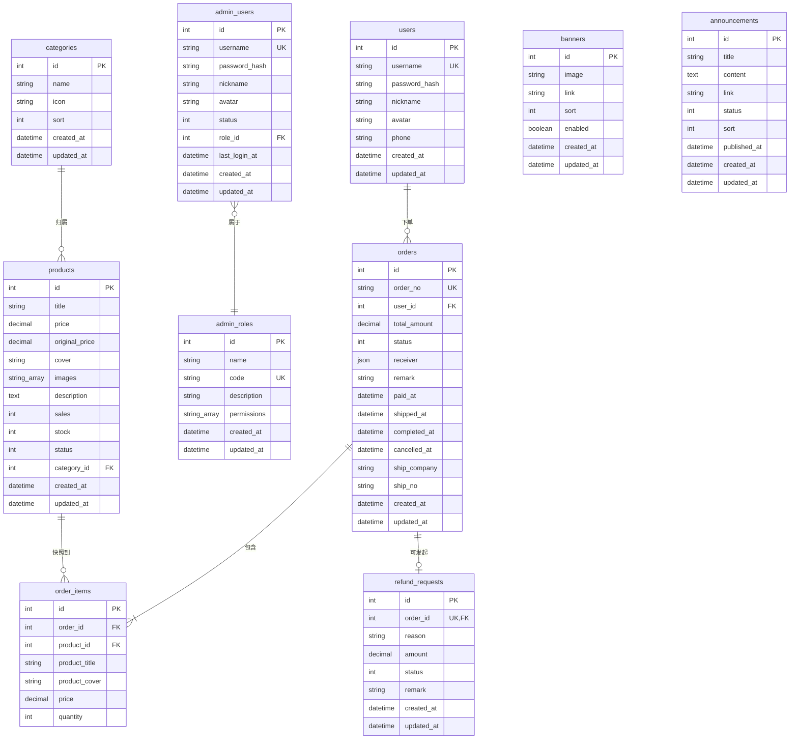

# 03 数据库 Schema 说明

> `server/prisma/schema.prisma` 完整说明，含 ER 关系图、字段含义、迁移历史。

## 1. 总览

数据库：PostgreSQL（`provider = "postgresql"`）。

Phase 1 完成后共 **10 张表**：

| 表 | 中文 | 来源 |
| --- | --- | --- |
| `users` | 前台买家 | 初始迁移 |
| `admin_users` | 后台管理员 | Phase 1 增量 |
| `admin_roles` | 后台角色 + 权限 | Phase 1 增量 |
| `categories` | 商品分类 | 初始迁移 |
| `products` | 商品 | 初始迁移 |
| `banners` | 轮播图 | 初始迁移 |
| `announcements` | 公告 | Phase 1 增量 |
| `orders` | 订单 | Phase 1 增量 |
| `order_items` | 订单商品快照 | Phase 1 增量 |
| `refund_requests` | 退款申请 | Phase 1 增量（先建表，UI 在 Phase 2） |

## 2. ER 关系图



> 说明：`AdminUser` 在图中用 `}o--||` 表示「多对一」（多个管理员属于一个角色）。

## 3. 字段说明

### `users`（前台买家）

| 字段 | 类型 | 说明 |
| --- | --- | --- |
| `id` | int | 主键，自增 |
| `username` | string | 唯一 |
| `passwordHash` | string | bcrypt 哈希 |
| `nickname` | string? | 可空 |
| `avatar` | string? | 可空，URL |
| `phone` | string? | 可空 |
| `createdAt` / `updatedAt` | datetime | Prisma 自动维护 |

### `admin_users`（后台管理员）

| 字段 | 类型 | 说明 |
| --- | --- | --- |
| `status` | int | `1` 启用 / `0` 禁用；登录时被 `AdminAuthService.login` 校验 |
| `roleId` | int FK → `admin_roles.id` | 必有 |
| `lastLoginAt` | datetime? | 每次登录成功更新 |
| 其余 | — | 与 `users` 类似 |

> 索引：`@@index([roleId])`

### `admin_roles`（后台角色）

| 字段 | 类型 | 说明 |
| --- | --- | --- |
| `code` | string UK | 例如 `SUPER_ADMIN` / `ADMIN`，登录后写入 JWT |
| `permissions` | `String[]` | PostgreSQL 数组；`*` 表示通配超管权限 |

> 默认 seed：`SUPER_ADMIN`（`['*']`）、`ADMIN`（详细权限码见 `06-数据迁移与Seed脚本.md`）。

### `categories`（分类）

| 字段 | 类型 | 说明 |
| --- | --- | --- |
| `name` | string | 唯一由业务层校验（`AdminCategoriesService.create` 查重抛 `ConflictException`） |
| `icon` | string? | 图标 URL，移动端首页宫格用 |
| `sort` | int | 升序排列，列表可调 |

### `products`（商品）

| 字段 | 类型 | 说明 |
| --- | --- | --- |
| `price` | `Decimal(10,2)` | 现价 |
| `originalPrice` | `Decimal(10,2)?` | 原价（划线价），可空 |
| `cover` | string | 列表封面 URL |
| `images` | `String[]` | 详情页图片列表 |
| `description` | `Text?` | 富文本 |
| `sales` | int | 累计销量；下单时 `+quantity` |
| `stock` | int | 库存；下单时 `-quantity` |
| `status` | int | `1` 上架 / `0` 下架；下单时校验 |
| `categoryId` | int FK → `categories.id` | `onDelete: Restrict`（有商品时禁止删分类） |

> 索引：`@@index([categoryId])`

### `banners`（轮播图）

| 字段 | 类型 | 说明 |
| --- | --- | --- |
| `image` | string | 必填 URL |
| `link` | string? | 跳转路径，移动端点击跳转（演示版 link 字段未消费） |
| `enabled` | boolean | 仅 `enabled = true` 出现在客户端 |

### `announcements`（公告）

| 字段 | 类型 | 说明 |
| --- | --- | --- |
| `status` | int | `0` 草稿 / `1` 已发布 |
| `publishedAt` | datetime? | 首次发布时写入，再次发布不覆盖 |

### `orders`（订单）

| 字段 | 类型 | 说明 |
| --- | --- | --- |
| `orderNo` | string UK | 时间戳 + 随机后缀（`ClientOrdersService.generateOrderNo`） |
| `status` | int | 见下方状态枚举 |
| `receiver` | `Json` | `{ name, phone, address }` |
| `paidAt` / `shippedAt` / `completedAt` / `cancelledAt` | datetime? | 状态流转时自动写入 |
| `shipCompany` / `shipNo` | string? | 发货时填入 |

订单状态枚举：

| code | 含义 |
| --- | --- |
| `0` PENDING | 待付款 |
| `1` PAID | 已付款 / 待发货 |
| `2` SHIPPED | 已发货 / 待收货 |
| `3` COMPLETED | 已完成 |
| `4` CANCELLED | 已取消 |

> 索引：`@@index([userId])`、`@@index([status])`

### `order_items`（订单商品快照）

> 设计要点：**快照**字段（`productTitle` / `productCover` / `price`）在创建订单时直接写入。即便后续商品改名 / 改价，订单详情展示保持下单时的样子。

| 字段 | 类型 | 说明 |
| --- | --- | --- |
| `productId` | int FK → `products.id` | **保留关联**，便于统计 / 售后 |
| `productTitle` / `productCover` / `price` | string/string/decimal | 快照 |
| `quantity` | int | 购买数量 |

> 索引：`@@index([orderId])`、`onDelete: Cascade`（删订单时一起删 items）

### `refund_requests`（退款申请）

| 字段 | 类型 | 说明 |
| --- | --- | --- |
| `orderId` | int UK, FK → `orders.id` | 一个订单最多一次退款申请 |
| `reason` | string | 退款原因 |
| `amount` | decimal | 退款金额（可与 `totalAmount` 不同） |
| `status` | int | `0` 待审 / `1` 已批准 / `2` 已拒绝 / `3` 已退款（Phase 2 UI） |
| `onDelete: Cascade` | | 订单删 → 退款申请一起删 |

## 4. 迁移历史

`server/prisma/migrations/`

| 文件夹 | 迁移名 | 内容 |
| --- | --- | --- |
| `20260911055156_init/` | `init` | 初始：`users`、`categories`、`products`、`banners` |
| `20260911063637_phase1_admin_and_orders/` | `phase1_admin_and_orders` | Phase 1 增量：`admin_users`、`admin_roles`、`announcements`、`orders`、`order_items`、`refund_requests` |

迁移命名约定：`<时间戳>_<简述>`，时间戳由 Prisma 自动生成（YYYYMMDDhhmmss）。

详见 `06-数据迁移与Seed脚本.md`。

## 5. Prisma 常用查询示例

> 完整 Prisma 文档参考 [prisma.io/docs](https://www.prisma.io/docs)

```ts
// 单条 + include
const order = await prisma.order.findUnique({
  where: { id },
  include: {
    user: { select: { id: true, username: true, nickname: true } },
    items: true
  }
})

// 条件 + 排序 + 分页
const [total, list] = await prisma.$transaction([
  prisma.order.count({ where }),
  prisma.order.findMany({
    where,
    orderBy: [{ id: 'desc' }],
    skip: (page - 1) * pageSize,
    take: pageSize
  })
])

// 事务（创建订单 + 扣库存 + 增销量）
const order = await prisma.$transaction(async (tx) => {
  for (const it of items) {
    await tx.product.update({
      where: { id: it.productId },
      data: {
        stock: { decrement: it.quantity },
        sales: { increment: it.quantity }
      }
    })
  }
  return tx.order.create({ data: { ...orderData, items: { create: items } } })
})
```

## 6. 相关文档

- 模块清单：`02-模块总览.md`
- 迁移 / Seed 步骤：`06-数据迁移与Seed脚本.md`
- 订单状态机：`02-模块总览.md` 与 `20-管理后台/06-订单管理.md`
