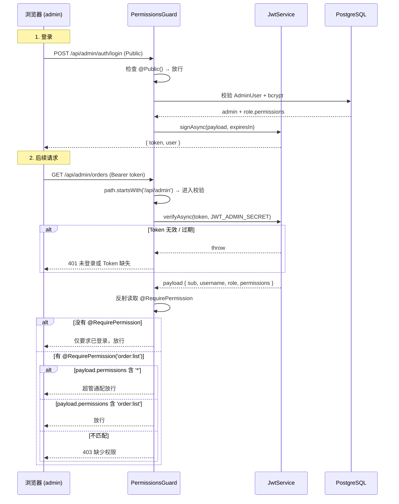
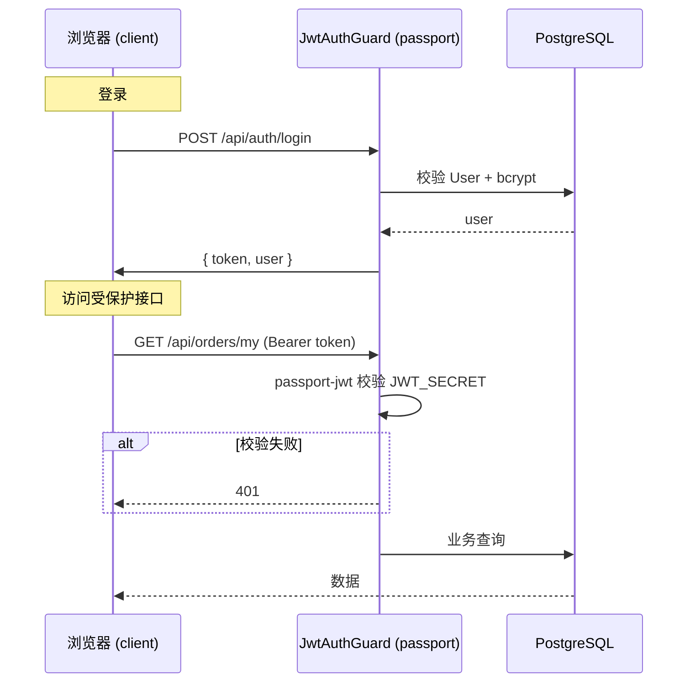

# 04 认证与权限体系

> 项目里有**两套互不干扰**的 JWT：一套给移动端用户（`passport-jwt`），一套给后台管理员（直验 + PermissionsGuard）。本文档讲清楚两套机制如何共存、Token 如何签发与校验、权限码如何生效。

## 1. 总览对比

| 维度 | 前台（client） | 后台（admin） |
| --- | --- | --- |
| 模块 | `AuthModule` | `AdminAuthModule` |
| 策略 | `passport-jwt` + `JwtStrategy` | `PermissionsGuard` 直验 |
| 守卫 | `JwtAuthGuard`（passport） | `PermissionsGuard`（自实现） |
| Secret | `JWT_SECRET` | `JWT_ADMIN_SECRET` |
| 过期 | `JWT_EXPIRES_IN`（默认 `7d`） | `JWT_ADMIN_EXPIRES_IN`（默认 `7d`） |
| Token 字段 | `sub` / `username` | `sub` / `username` / `role` / `permissions` |
| 拦截范围 | 仅挂在 `@UseGuards(JwtAuthGuard)` 的端点 | **全局**对 `/api/admin/*` 自动生效 |

> ⚠️ 两个 secret **必须不同**，否则前后台 Token 互相通过校验，权限隔离失效。

## 2. 后台 Token 流程



## 3. 前台 Token 流程



## 4. 关键代码定位

| 文件 | 角色 |
| --- | --- |
| `server/src/admin-auth/admin-auth.service.ts` | 登录签发 Token、读 profile |
| `server/src/admin-auth/guards/permissions.guard.ts` | **全局生效**的守卫（直验 JWT + 校验权限） |
| `server/src/admin-auth/strategies/admin-jwt.strategy.ts` | passport-jwt 策略（保留供未来扩展） |
| `server/src/admin-auth/decorators/require-permission.decorator.ts` | `@RequirePermission('user:list')` |
| `server/src/admin-auth/decorators/public.decorator.ts` | `@Public()`（当前未实际被守卫读取） |
| `server/src/admin-auth/types.ts` | `AdminPermission` 类型别名 |
| `server/src/auth/strategies/jwt.strategy.ts` | 前台 passport-jwt 策略 |
| `server/src/auth/strategies/jwt-auth.guard.ts` | 前台 `JwtAuthGuard`（继承 `AuthGuard('jwt')`） |
| `server/src/auth/decorators/current-user.decorator.ts` | 前台 `@CurrentUser()` |

## 5. 权限码体系

来源：`server/prisma/seed.ts` 的 `ADMIN_PERMISSIONS` 数组。

```text
dashboard:view

user:list        user:detail      user:edit
product:list     product:create   product:edit
product:on_off   product:adjust_stock

category:list    category:create  category:edit   category:delete

order:list       order:detail     order:ship      order:cancel

banner:list      banner:create    banner:edit     banner:delete

announcement:list       announcement:create    announcement:edit
announcement:publish    announcement:delete
```

- `SUPER_ADMIN` 角色：`permissions = ['*']` → 守卫中 `permissions.includes('*')` 直接放行
- `ADMIN` 角色：上述列表（不含删除 / 角色分配等敏感操作）
- `@RequirePermission()` 空参 = 仅要求已登录，不校验具体权限

## 6. 自定义装饰器详解

### `@RequirePermission(...perms)`

```ts
// server/src/admin-auth/decorators/require-permission.decorator.ts
export const PERMISSIONS_KEY = 'admin:permissions'
export const RequirePermission = (...perms: AdminPermission[]) =>
  SetMetadata(PERMISSIONS_KEY, perms)
```

用法：

```ts
@RequirePermission('order:list')
@Get()
list() { ... }

@RequirePermission('product:on_off')
@Patch(':id/status')
setStatus() { ... }
```

### `@Public()`

```ts
export const IS_PUBLIC_KEY = 'isPublic'
export const Public = () => SetMetadata(IS_PUBLIC_KEY, true)
```

> 当前实现：`PermissionsGuard` 内只对 `req.path.startsWith('/api/admin')` 起作用，因此 `/api/admin/auth/login` 也会进入守卫路径，但**不会检查 Token**——因为没有 `@RequirePermission()`，且守卫第一段是「未带 Bearer」就抛 401。

**等等——这与实际不符？** 看代码：

```ts
// permissions.guard.ts 第 17~19 行
const isPublic = this.reflector.getAllAndOverride<boolean>(IS_PUBLIC_KEY, [...])
if (isPublic) return true
```

守卫确实读了 `@Public()`，遇到 `@Public()` 直接返回 true。所以 `login` 端点靠 `@Public()` 跳过守卫。

> ⚠️ 注意：守卫**对 `/api/admin/*` 之外不生效**（line 24），所以前台公开端点（`/api/categories` 等）不会被该守卫拦截；只有后台模块会被强制要求 Bearer Token。

### 前台 `@CurrentUser()`

```ts
// server/src/auth/decorators/current-user.decorator.ts
export const CurrentUser = createParamDecorator(
  (_data, ctx: ExecutionContext): JwtPayload => {
    const req = ctx.switchToHttp().getRequest()
    return req.user
  }
)
```

用法：

```ts
@UseGuards(JwtAuthGuard)
@Get('my')
listMy(@CurrentUser() user: JwtPayload) {
  return this.svc.listMy(user.sub, ...)
}
```

## 7. PermissionsGuard 完整逻辑

文件：`server/src/admin-auth/guards/permissions.guard.ts`

```ts
async canActivate(ctx: ExecutionContext): Promise<boolean> {
  // 0. 公开路由直接放行
  const isPublic = this.reflector.getAllAndOverride<boolean>(IS_PUBLIC_KEY, [...])
  if (isPublic) return true

  // 路径不是 /api/admin/* → 不归本守卫管，放行
  const req = ctx.switchToHttp().getRequest<{ path: string }>()
  if (!req.path.startsWith('/api/admin')) return true

  // 1. 校验 Bearer Token
  const auth = req.headers['authorization']
  if (!auth?.startsWith('Bearer ')) throw new UnauthorizedException('未登录或 Token 缺失')

  let payload: AdminAuthedUser
  try {
    const decoded = await this.jwt.verifyAsync(auth.slice(7), {
      secret: this.config.get<string>('JWT_ADMIN_SECRET') ?? 'dev-admin-secret'
    })
    payload = { sub, username, role, permissions: decoded.permissions ?? [] }
    authedReq.user = payload
  } catch {
    throw new UnauthorizedException('Token 无效或已过期')
  }

  // 2. 检查 @RequirePermission
  const required = this.reflector.getAllAndOverride<AdminPermission[]>(
    PERMISSIONS_KEY, [ctx.getHandler(), ctx.getClass()]
  )
  if (!required || required.length === 0) return true

  if (payload.permissions.includes('*')) return true

  const ok = required.some((p) => payload.permissions.includes(p))
  if (!ok) throw new ForbiddenException(`缺少权限: ${required.join(' / ')}`)
  return true
}
```

要点：

1. 全局生效：`AdminAuthModule` 通过 `APP_GUARD` provider 把 `PermissionsGuard` 注册成根级守卫，NestJS 会把它应用到所有路由。来源：`server/src/admin-auth/admin-auth.module.ts` 的 `providers: [AdminAuthService, PermissionsGuard, { provide: APP_GUARD, useClass: PermissionsGuard }]`。

2. 路径过滤：守卫仅作用于 `/api/admin/*`，前台接口不会被它拦截。
3. Token 校验失败一律 401，权限不足 403。

## 8. 前台守卫与端点现状

| 控制器 | 是否加守卫 |
| --- | --- |
| `AuthController` | 仅 `profile` 加 `@UseGuards(JwtAuthGuard)` |
| `CategoriesController` | 否（公开） |
| `ProductsController` | 否（公开） |
| `ClientBannersController` | 否（公开） |
| `ClientOrdersController` | **整个控制器** `@UseGuards(JwtAuthGuard)` |

## 9. 调试与排查

| 现象 | 排查 |
| --- | --- |
| 后台 401「未登录或 Token 缺失」 | 确认请求带 `Authorization: Bearer <token>`；Token 是否过期 |
| 后台 401「Token 无效或已过期」 | 检查 `JWT_ADMIN_SECRET` 在 server 启动时是否设置；两端 secret 是否一致 |
| 后台 403「缺少权限」 | 该用户在 `Role.permissions` 中没有该权限码；SUPER_ADMIN 走通配 |
| 前台 401 | `JWT_SECRET` 是否设置；Token 是否过期 |
| 前台公开端点突然要登录 | 确认是否误加了 `@UseGuards` |

## 10. 如何新增一个权限码

1. 在 `server/prisma/seed.ts` 的 `ADMIN_PERMISSIONS` 数组里追加字符串
2. 后台对应 `controller` 方法上加 `@RequirePermission('your:perm')`
3. 前端按钮上加 `v-permission="'your:perm'"`
4. 重跑 `npm run prisma:seed`，`operator` 账号重新拿到权限列表
5. `admin` 账号无需改（SUPER_ADMIN 通配）

## 11. 相关文档

- 模块清单：`02-模块总览.md`
- 数据库表结构：`03-数据库Schema说明.md`
- Seed 数据：`06-数据迁移与Seed脚本.md`
- 后台登录页：`20-管理后台/02-账号权限与登录.md`
