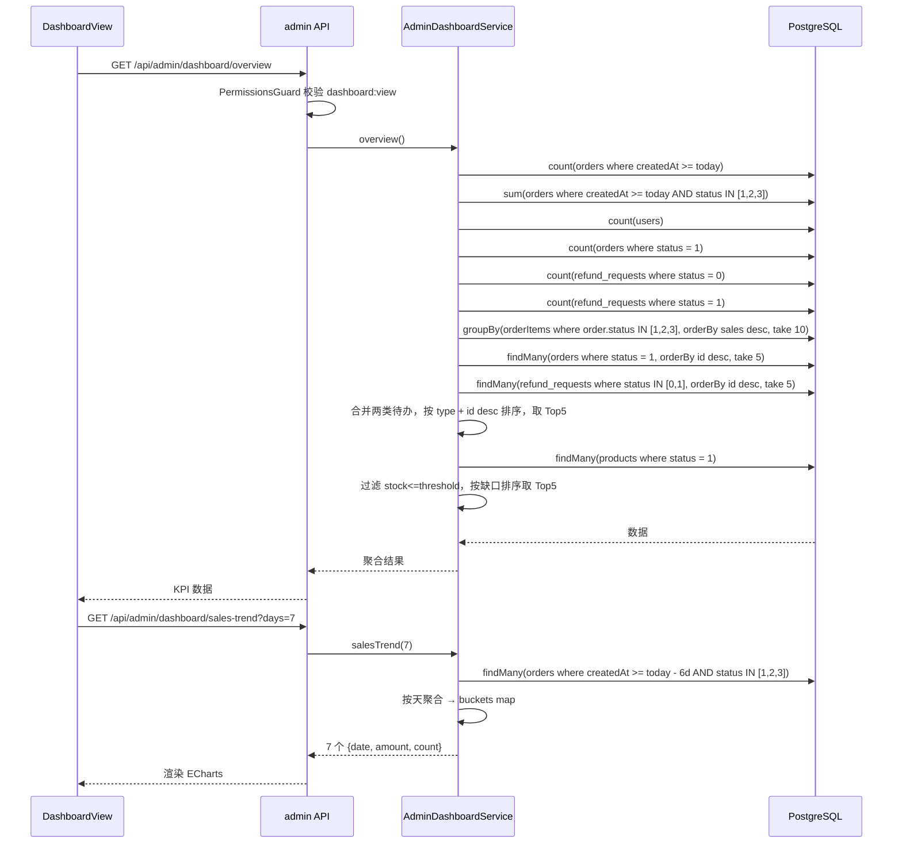

# 03 仪表盘

> 后台首页，聚合展示今日核心指标 + 销售趋势 + 热销 Top10 + 运营待办 Top5。
> "运营待办"包括：待发货订单、待审退款、待打款三种工单类型。

## 1. 模块定位

后台登录后的默认首页。运营快速看当日整体情况和待办工单，无需逐个进模块。

## 2. 涉及数据表

| 表 | 用途 |
| --- | --- |
| `orders` | 今日订单数、GMV、待发货订单数、运营待办中的订单 Top5、热销 Top10（按 `sales`） |
| `users` | 总用户数 |
| `refund_requests` | 待审退款数、待打款数、运营待办中的退款 Top5 |
| `products` | 库存预警、热销 Top10（按 `sales`） |

详见 `10-服务端/03-数据库Schema说明.md`。

## 3. Server 接口清单

文件：`server/src/admin-dashboard/`

| 方法 | 路径 | 权限 | 说明 |
| --- | --- | --- | --- |
| `GET` | `/api/admin/dashboard/overview` | `dashboard:view` | 聚合 KPI |
| `GET` | `/api/admin/dashboard/sales-trend?days=1..30` | `dashboard:view` | 按天趋势，默认 7 天 |

### `/overview` 返回结构

```ts
{
  todayOrders: number              // 今日订单数（所有状态）
  todayGmv: number                 // 今日 GMV（status in [1,2,3] 合计）
  totalUsers: number               // 总用户数
  pendingShipOrders: number        // 待发货订单数（Order.status = 1）
  pendingRefundReviews: number     // 待审退款数（RefundRequest.status = 0）
  pendingRefunds: number           // 待打款数（RefundRequest.status = 1 已批准）
  topProducts: Array<{             // 热销 Top10
    productId: number
    title: string
    cover: string
    sales: number
    gmv: number
  }>
  pendingItems: Array<{            // 运营待办 Top5（混合订单 + 退款）
    type: 'order' | 'refund'
    id: number                     // 订单 ID 或退款 ID
    refId: number                  // 同 id，供前端跳转使用
    title: string                  // 订单的 orderNo，或退款的占位 '#orderId'
    subtitle: string               // 用户名 / 昵称
    amount: number                 // 订单 totalAmount 或退款 amount
    createdAt: Date
    status: number                 // order: 1; refund: 0 或 1
  }>
  lowStockCount: number
  lowStockProducts: Array<{
    id: number
    title: string
    cover: string
    stock: number
    threshold: number
  }>
}
```

> **排序规则**：合并后先按 `type`（订单优先于退款），同类型内按 `id desc`。
> 订单取 `Order.status=1` 最新 5 条；退款取 `RefundRequest.status IN (0,1)` 最新 5 条；最终合并后再取 Top5。

### `/sales-trend` 返回结构

```ts
Array<{
  date: string     // 'YYYY-MM-DD'
  amount: number   // 当日 GMV（status in [1,2,3]）
  count: number    // 当日订单数
}>
```

> 边界处理：`days` 参数被夹在 `[1, 30]`。若数据库没有某天订单，返回 `{ amount: 0, count: 0 }`（**不漏点**），前端折线图不会出现断崖。

## 4. Admin 路由与页面

- **路由**：`/dashboard`
- **权限**：`dashboard:view`
- **文件**：`admin/src/views/DashboardView.vue`
- **布局**：在 `AdminLayout` 子路由下
- **关键组件**：Element Plus `el-row` / `el-col` + `el-card` KPI 卡片 + ECharts 折线图 + `el-table` 热销 / 待办 / 库存预警

## 5. KPI 卡片（7 个）

### 5.1 数据卡（3 张）

| 卡 | 来源字段 | 说明 |
| --- | --- | --- |
| 今日订单 | `todayOrders` | 含所有状态 |
| 今日 GMV | `todayGmv` | 仅计入已付 / 已发 / 已完成 |
| 注册用户 | `totalUsers` | 全量前台用户 |

### 5.2 运营待办卡（3 张，可点击跳转）

| 卡 | 来源字段 | 点击跳转 |
| --- | --- | --- |
| 待发货订单 | `pendingShipOrders` | `/orders?status=1`（自动切到待发货 tab） |
| 待审退款 | `pendingRefundReviews` | `/refunds?status=0` |
| 待打款 | `pendingRefunds` | `/refunds?status=1` |

> 数字 > 0 时数字着红色（`.kpi-value.danger`）以视觉提醒。

### 5.3 库存预警卡（1 张，整行展示，可点击跳转）

| 卡 | 来源字段 | 点击跳转 |
| --- | --- | --- |
| 库存预警 | `lowStockCount` | `/inventory/warnings` |

## 6. 销售趋势折线图（ECharts）

```ts
// DashboardView.vue 节选
const chart = echarts.init(chartRef.value)
chart.setOption({
  tooltip: { trigger: 'axis' },
  xAxis: { type: 'category', data: trend.value.map((t) => t.date) },
  yAxis: { type: 'value' },
  series: [{
    name: 'GMV',
    type: 'line',
    smooth: true,
    areaStyle: { opacity: 0.2 },
    data: trend.value.map((t) => t.amount)
  }]
})
```

- **默认展示 7 天，写死 `getSalesTrend(7)`**（当前实现无切换控件）
- X 轴是日期字符串，Y 轴是金额
- 区域渐变 + 平滑曲线

## 7. 运营待办 Top5

> 原"待处理订单 Top5"已扩展为"运营待办 Top5"，混合展示待发货订单 + 待审/待打款退款申请。

| 列 | 字段 | 说明 |
| --- | --- | --- |
| 类型 | `type` 派生 label | `order` → 待发货，`refund` → 退款 |
| 订单号 / 退款 ID | `title` | 订单的 `orderNo`；退款目前用 `order.orderNo` 作为标题 |
| 金额 | `amount` | 订单 `totalAmount` 或退款 `amount` |

### 7.1 列表项点击跳转

`@row-click="goPendingItem"`：

- `type === 'order'` → `router.push({ name: 'admin-orders', query: { focus: id, status: 1 } })`
- `type === 'refund'` → `router.push({ name: 'admin-refund-detail', params: { id } })`

### 7.2 目标页面支持的 query 参数

| 参数 | 适用页面 | 行为 |
| --- | --- | --- |
| `?status=N` | `OrderListView`、`RefundListView` | 挂载时回填 `query.status`，对应 tab 高亮 |
| `?focus=ID` | `OrderListView` | 挂载时调用 `getAdminOrder(ID)` 并打开详情抽屉 |

实现位置：

- `admin/src/views/OrderListView.vue:48-75`
- `admin/src/views/RefundListView.vue:48-58`

## 8. 热销商品 Top10

| 列 | 字段 | 说明 |
| --- | --- | --- |
| 排名 | （前端生成） | 1..10 |
| 封面 | `cover` | 缩略图 |
| 商品名 | `title` | 文本 |
| 销量 | `sales` | 累计销量 |
| GMV | `gmv` | 销量 × 现价（前端计算） |

> 数据按 `sales desc` 取前 10；后端在 `AdminDashboardService.overview` 中实现。

## 9. 关键流程



## 10. 权限点

| 权限码 | 用途 |
| --- | --- |
| `dashboard:view` | 访问 `/dashboard` 路由 + 两个聚合接口 |

> 路由 meta 与接口都用同一权限码。`SUPER_ADMIN` 通配放行。

## 11. 相关文档

- 接口定义：`10-服务端/02-模块总览.md`（AdminDashboardModule 节）
- 数据表：`10-服务端/03-数据库Schema说明.md`
- 订单状态机：`06-订单管理.md`
- 退款状态机：`11-退款与售后.md`
- 跳转目标页面：`06-订单管理.md`（订单列表 + 详情抽屉）、`11-退款与售后.md`（退款列表 + 详情路由）