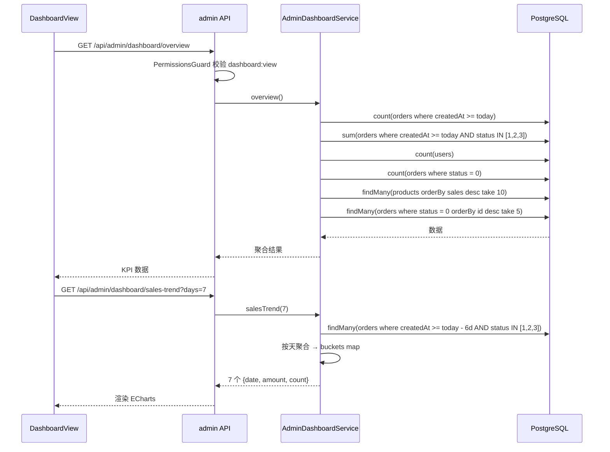

# 03 仪表盘

> 后台首页，聚合展示今日核心指标 + 销售趋势 + 热销 Top10 + 待处理订单 Top5。

## 1. 模块定位

后台登录后的默认首页。运营 / 商家快速看当日整体情况，无需逐个进模块。

## 2. 涉及数据表

| 表 | 用途 |
| --- | --- |
| `orders` | 今日订单数、GMV、待处理订单、热销 Top10（按 `sales`）、待处理 Top5 |
| `users` | 总用户数 |
| `products` | 热销 Top10（按 `sales desc`） |

详见 `10-服务端/03-数据库Schema说明.md`。

## 3. Server 接口清单

文件：`server/src/admin-dashboard/`

| 方法 | 路径 | 权限 | 说明 |
| --- | --- | --- | --- |
| `GET` | `/api/admin/dashboard/overview` | `dashboard:view` | 聚合 KPI |
| `GET` | `/api/admin/dashboard/sales-trend?days=1..30` | `dashboard:view` | 按天趋势，默认 7 天 |

### `/overview` 返回结构

```ts
{
  todayOrders: number              // 今日订单数（所有状态）
  todayGmv: number                 // 今日 GMV（status in [1,2,3] 的订单金额合计）
  totalUsers: number               // 总用户数（所有前台用户）
  pendingOrders: number            // 待处理订单数（status = 0）
  topProducts: Array<{             // 热销 Top10，按 sales desc
    id: number
    title: string
    cover: string
    sales: number
    stock: number
    price: number
    count: number                  // 销量（同 sales）
  }>
  pendingOrderList: Array<{        // 待处理订单 Top5（status = 0，按 id desc）
    id: number
    orderNo: string
    totalAmount: number
    createdAt: Date
    user: { username: string; nickname: string | null }
  }>
}
```

### `/sales-trend` 返回结构

```ts
Array<{
  date: string     // 'YYYY-MM-DD'
  amount: number   // 当日 GMV（status in [1,2,3]）
  count: number    // 当日订单数
}>
```

> 边界处理：`days` 参数被夹在 `[1, 30]`。若数据库没有某天订单，返回 `{ amount: 0, count: 0 }`（**不漏点**），前端折线图不会出现断崖。

## 4. Admin 路由与页面

- **路由**：`/dashboard`
- **权限**：`dashboard:view`
- **文件**：`admin/src/views/DashboardView.vue`
- **布局**：在 `AdminLayout` 子路由下
- **关键组件**：Element Plus `el-row` / `el-col` + `el-card` KPI 卡片 + ECharts 折线图 + `el-table` 热销 / 待处理

## 5. KPI 卡片（4 个顶部卡）

| 卡 | 来源字段 | 说明 |
| --- | --- | --- |
| 今日订单数 | `todayOrders` | 含所有状态 |
| 今日 GMV | `todayGmv` | 仅计入已付 / 已发 / 已完成 |
| 总用户数 | `totalUsers` | 全量前台用户 |
| 待处理订单 | `pendingOrders` | `status = 0` 的订单数 |

## 6. 销售趋势折线图（ECharts）

```ts
// DashboardView.vue 节选
const chart = echarts.init(chartRef.value)
chart.setOption({
  tooltip: { trigger: 'axis' },
  xAxis: { type: 'category', data: trend.value.map((t) => t.date) },
  yAxis: { type: 'value' },
  series: [{
    name: 'GMV',
    type: 'line',
    smooth: true,
    areaStyle: { opacity: 0.2 },
    data: trend.value.map((t) => t.amount)
  }]
})
```

- 默认展示 7 天；切换下拉可改为 14 / 30
- X 轴是日期字符串，Y 轴是金额
- 区域渐变 + 平滑曲线

## 7. 热销商品 Top10

| 列 | 字段 | 说明 |
| --- | --- | --- |
| 商品 | `title` | 文本，可加封面缩略图 |
| 价格 | `price` | 现价 |
| 销量 | `sales` | 累计销量 |
| 库存 | `stock` | 库存预警时关注 |

> 数据按 `sales desc` 取前 10；后端在 `AdminDashboardService.overview` 中实现。

## 8. 待处理订单 Top5

| 列 | 字段 |
| --- | --- |
| 订单号 | `orderNo` |
| 金额 | `totalAmount` |
| 用户 | `user.username` / `user.nickname` |
| 创建时间 | `createdAt` |

> 点击行直接跳转 `/orders`（管理员处理）。也可以加「去处理」按钮。

## 9. 关键流程



## 10. 权限点

| 权限码 | 用途 |
| --- | --- |
| `dashboard:view` | 访问 `/dashboard` 路由 + 两个聚合接口 |

> 路由 meta 与接口都用同一权限码。`SUPER_ADMIN` 通配放行。

## 11. 相关文档

- 接口定义：`10-服务端/02-模块总览.md`（AdminDashboardModule 节）
- 数据表：`10-服务端/03-数据库Schema说明.md`
- 订单状态机：`06-订单管理.md`
