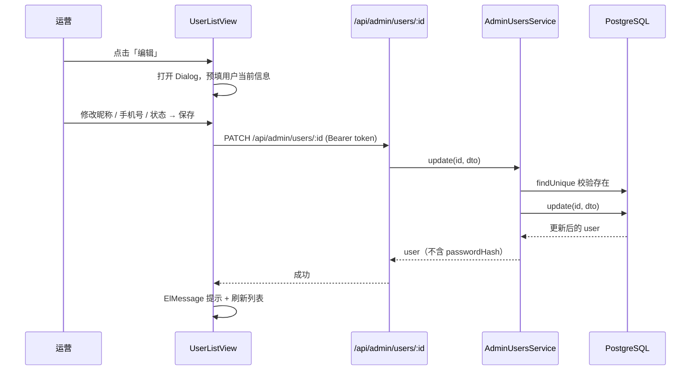

# 04 用户管理

> 后台管理**前台买家账号**的模块。注意：`AdminUser`（后台账号）的管理在 Phase 1 未做 UI（roadmap 1.6 延后）。

## 1. 模块定位

运营 / 客服使用，处理：

- 查询用户（按用户名 / 昵称 / 手机号）
- 查看用户详情（含历史订单数）
- 启 / 禁用账号
- 修改昵称 / 手机号

> 当前阶段**不支持删除**用户（roadmap 标记「删除」延后到 Phase 2 之后）。

## 2. 涉及数据表

| 表 | 用途 |
| --- | --- |
| `users` | 前台买家账号本体 |
| `orders` | 详情页通过 `_count.orders` 聚合订单数 |

详见 `10-服务端/03-数据库Schema说明.md`。

## 3. Server 接口清单

文件：`server/src/admin-users/`

| 方法 | 路径 | 权限 | 说明 |
| --- | --- | --- | --- |
| `GET` | `/api/admin/users` | `user:list` | 列表（分页 + 状态筛选 + 关键字搜索） |
| `GET` | `/api/admin/users/:id` | `user:detail` | 详情（含 `_count.orders`） |
| `PATCH` | `/api/admin/users/:id` | `user:edit` | 更新（启/禁用、改昵称/手机号） |

### 查询 DTO（`admin-users/dto/query-user.dto.ts`）

```ts
export class QueryUserDto extends PaginationDto {
  @IsOptional() @Type(() => Number) @IsInt() @Min(0) status?: number
}
```

继承 `PaginationDto`，自带 `page` / `pageSize` / `keyword`。

### 更新 DTO（`admin-users/dto/update-user.dto.ts`）

```ts
export class UpdateUserDto {
  @IsOptional() @IsString() @MaxLength(32) nickname?: string
  @IsOptional() @IsString() @MaxLength(20) phone?: string
  @IsOptional() @IsIn([0, 1])            status?: number
}
```

> 注意：不允许通过此接口改密码 / 用户名。改密码需要走单独的「重置密码」流程（Phase 2+）。

### 关键字搜索行为

`AdminUsersService.list` 的 `where.keyword` 用 `OR` 三字段模糊：

```ts
{
  OR: [
    { username: { contains: q.keyword, mode: 'insensitive' } },
    { nickname: { contains: q.keyword, mode: 'insensitive' } },
    { phone:    { contains: q.keyword, mode: 'insensitive' } }
  ]
}
```

不区分大小写，包含匹配。

### 返回结构

列表 / 详情都**剔除 `passwordHash`**：

```ts
const { passwordHash: _, ...rest } = user
return rest
```

返回字段：`id` / `username` / `nickname` / `avatar` / `phone` / `status` / `createdAt` / `updatedAt`；详情额外带 `_count.orders`。

## 4. Admin 路由与页面

- **路由**：`/users`
- **权限**：`user:list`（路由 meta）+ `user:edit`（编辑按钮的 `v-permission`）
- **文件**：`admin/src/views/UserListView.vue`

### 关键 UI 元素

- 顶部筛选：状态（启用 / 禁用）+ 搜索框（用户名 / 昵称 / 手机号）
- 表格列：ID / 用户名 / 昵称 / 手机号 / 状态（el-tag）/ 注册时间 / 操作（详情 / 编辑）
- 详情 Drawer：基本信息 + 历史订单数（`_count.orders`）+ 头像
- 编辑 Dialog：仅昵称、手机号、状态可改

## 5. 关键代码片段

### 列表查询

```ts
// UserListView.vue
const { list, total, page, pageSize, loading, search, reset } = usePaginatedList({
  fetcher: (q) => listAdminUsers(q),
  initialQuery: { page: 1, pageSize: 10 }
})
```

### 编辑用户

```ts
async function saveEdit() {
  await updateAdminUser(editForm.value.id, {
    nickname: editForm.value.nickname,
    phone: editForm.value.phone,
    status: editForm.value.status
  })
  ElMessage.success('已更新')
  dialogVisible.value = false
  load()
}
```

## 6. 关键流程（编辑用户）



## 7. 权限点

| 权限码 | 用途 |
| --- | --- |
| `user:list` | 路由访问 + 列表查询 |
| `user:detail` | 详情接口 + 详情 Drawer |
| `user:edit` | 编辑接口 + 编辑按钮 |

`ADMIN` 默认不含 `user:edit`，仅 `SUPER_ADMIN` 可编辑用户（与 seed 中的 `ADMIN_PERMISSIONS` 对齐）。

## 8. 边界与注意

- 启禁用状态：`users` 表**根本没有 `status` 字段**（schema 见 `10-服务端/03-数据库Schema说明.md`），所以「禁用前台用户」在数据层就不成立。运营通过后台把 `status` 改成 0 后，前台**依然能正常登录**——这仅是「运营标记」。
- **生产化阶段需要**：先给 `User` schema 加 `status Int @default(1)` 字段并迁移，再在 `AuthService.login` 增加 `user.status !== 1` 校验，最后在 `AuthService.register` 设默认 1。
- 用户删除：当前不支持。若需清理测试数据，直接 `prisma.user.deleteMany()` 或重跑 seed。
- 批量操作：暂未提供（Phase 2+）。

## 9. 相关文档

- 列表 / 详情 / 编辑接口：`10-服务端/02-模块总览.md`（AdminUsersModule 节）
- 数据表：`10-服务端/03-数据库Schema说明.md`
- 账号体系总览：`02-账号权限与登录.md`
