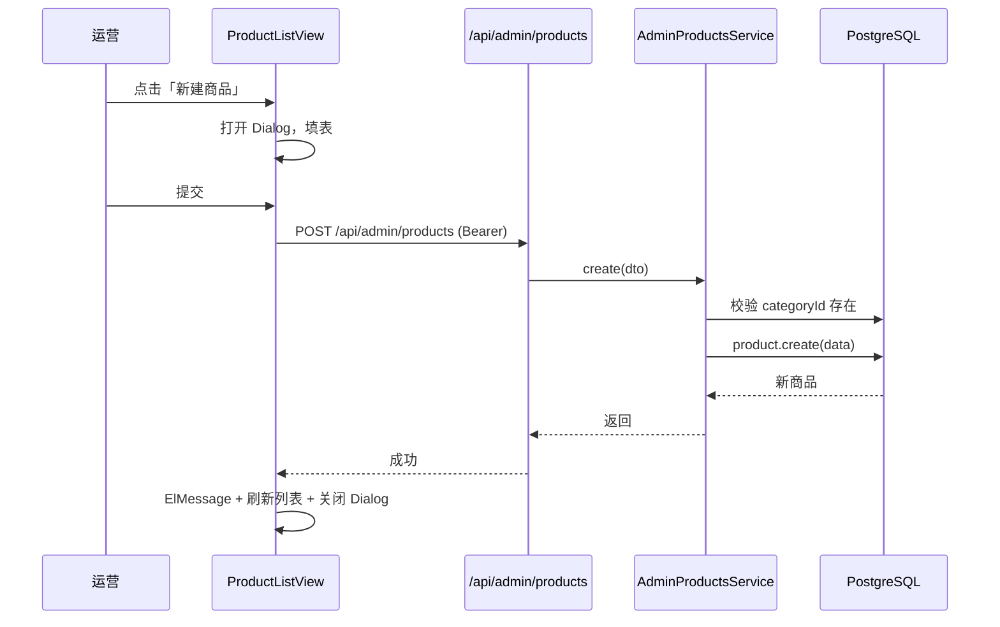

# 05 商品与分类管理

> 两个紧密相关的模块合并到一份文档里：分类列表 + 商品列表 + 商品表单。

## 1. 模块定位

| 子模块 | 用途 |
| --- | --- |
| 分类管理 | 商品类目的增删改 + 排序（首页宫格来源） |
| 商品管理 | 商品的 CRUD + 上下架 + 库存调整 + 价格区间筛选 |

## 2. 涉及数据表

| 表 | 用途 |
| --- | --- |
| `categories` | 分类 |
| `products` | 商品；含 `categoryId` 外键 |

详见 `10-服务端/03-数据库Schema说明.md`。

## 3. Server 接口清单

### 分类（`server/src/admin-categories/`）

| 方法 | 路径 | 权限 | 说明 |
| --- | --- | --- | --- |
| `GET` | `/api/admin/categories` | `category:list` | 列表（含 `_count.products`） |
| `GET` | `/api/admin/categories/:id` | `category:list` | 详情 |
| `POST` | `/api/admin/categories` | `category:create` | 创建（名称查重） |
| `PATCH` | `/api/admin/categories/:id` | `category:edit` | 更新 |
| `DELETE` | `/api/admin/categories/:id` | `category:delete` | 删除（分类下还有商品时拒绝） |

分类 DTO（`admin-categories/dto/category.dto.ts`）：

```ts
export class CreateCategoryDto {
  @IsString() @MaxLength(32) name!: string
  @IsOptional() @IsString() @MaxLength(500) icon?: string
  @IsOptional() @IsInt() @Min(0) sort?: number
}
// UpdateCategoryDto 全部字段 optional
```

删除保护：

```ts
const count = await this.prisma.product.count({ where: { categoryId: id } })
if (count > 0) throw new ConflictException(`分类下还有 ${count} 个商品，无法删除`)
```

### 商品（`server/src/admin-products/`）

| 方法 | 路径 | 权限 | 说明 |
| --- | --- | --- | --- |
| `GET` | `/api/admin/products` | `product:list` | 列表（多条件筛选 + 分页） |
| `GET` | `/api/admin/products/:id` | `product:list` | 详情 |
| `POST` | `/api/admin/products` | `product:create` | 创建 |
| `PATCH` | `/api/admin/products/:id` | `product:edit` | 更新（部分字段） |
| `PATCH` | `/api/admin/products/:id/status` | `product:on_off` | 上下架（status 0/1） |
| `PATCH` | `/api/admin/products/:id/stock` | `product:adjust_stock` | 调整库存 |
| `DELETE` | `/api/admin/products/:id` | `product:delete` | 删除 |

商品查询 DTO（`admin-products/dto/product.dto.ts`）：

```ts
export class QueryProductDto {
  @IsOptional() @Type(() => Number) @IsInt() @Min(1) categoryId?: number
  @IsOptional() @Type(() => Number) @IsIn([0, 1])   status?: number
  @IsOptional() @Type(() => Number) @IsNumber() @Min(0) minPrice?: number
  @IsOptional() @Type(() => Number) @IsNumber() @Min(0) maxPrice?: number
  @IsOptional() @Type(() => Number) @IsInt() @Min(1)  page?: number = 1
  @IsOptional() @Type(() => Number) @IsInt() @Min(1)  pageSize?: number = 10
  @IsOptional() @IsString() @MaxLength(64)            keyword?: string
}
```

价格区间过滤：

```ts
if (q.minPrice !== undefined || q.maxPrice !== undefined) {
  where.price = {
    ...(q.minPrice !== undefined ? { gte: q.minPrice } : {}),
    ...(q.maxPrice !== undefined ? { lte: q.maxPrice } : {})
  }
}
```

关键字过滤：标题 `contains`，不区分大小写。

## 4. Admin 路由与页面

### 分类

- **路由**：`/categories`
- **权限**：`category:list`
- **文件**：`admin/src/views/CategoryListView.vue`

布局要点：

- 平铺表格（按 `sort asc`）
- 字段：ID / 名称 / 图标（缩略图）/ 排序 / 商品数（`_count.products`）/ 操作（编辑 / 删除）
- 「上移 / 下移」按钮调 `update(id, { sort: x })` 实现排序（无拖拽依赖）
- 新建 / 编辑 Dialog：name / icon URL / sort

### 商品

- **路由**：`/products`
- **权限**：`product:list`
- **文件**：`admin/src/views/ProductListView.vue`

布局要点：

- 顶部筛选：分类下拉 + 状态下拉 + 价格区间 + 关键字搜索
- 表格列：ID / 标题（封面缩略图）/ 分类 / 价格 / 库存 / 销量 / 状态（el-switch 直接切换）/ 操作（编辑 / 调库存 / 删除）
- 状态切换：调 `setStatus`，无需打开 Dialog
- 库存调整：调 `adjustStock`（弹小输入框）
- 删除：ElMessageBox 二次确认

### 商品表单 Dialog

字段：

- 标题（必填，2~128 字）
- 分类（必填，下拉）
- 价格（必填，>= 0）
- 原价（可选，>= 0）
- 封面 URL（必填）
- 图片列表（多 URL）
- 描述（textarea）
- 库存（默认 0）
- 状态（默认上架）

提交：`createAdminProduct(form)` 或 `updateAdminProduct(id, form)`。

## 5. 关键流程

### 商品创建



### 上下架切换

```ts
async function toggleStatus(row: AdminProduct) {
  const next = row.status === 1 ? 0 : 1
  await setAdminProductStatus(row.id, next)
  ElMessage.success(next === 1 ? '已上架' : '已下架')
  load()
}
```

对应后端：仅校验商品存在，更新 `status` 字段，**不联动商品缓存**（演示版无缓存）。

## 6. 权限点

### 分类

| 权限码 | 用途 |
| --- | --- |
| `category:list` | 列表 / 详情 + 路由 |
| `category:create` | 新建按钮 + 接口 |
| `category:edit` | 编辑按钮 + 接口 |
| `category:delete` | 删除按钮 + 接口 |

### 商品

| 权限码 | 用途 |
| --- | --- |
| `product:list` | 列表 / 详情 + 路由 |
| `product:create` | 新建按钮 + 接口 |
| `product:edit` | 编辑按钮 + 接口 |
| `product:on_off` | 上下架开关 + 接口 |
| `product:adjust_stock` | 库存调整 + 接口 |
| （删除） | 接口未挂权限；ADMIN 角色 seed 也不含删除权限 |

> ADMIN 默认权限包含：`list / create / edit / on_off / adjust_stock`。不包含删除（仅 SUPER_ADMIN 可删）。


## 导出 Excel

> 顶部「导出 Excel」按钮（`v-permission="`export:xxx`"`）按当前列表筛选条件调 `server/src/admin-exports/`：
>
> - 订单列表：`GET /api/admin/exports/orders`（权限 `export:orders`）
> - 商品列表：`GET /api/admin/exports/products`（权限 `export:products`）
> - 库存流水：`GET /api/admin/exports/inventory-logs`（权限 `export:inventory_logs`）
>
> 服务端用 `xlsx`（SheetJS）生成二进制 Buffer，`StreamableFile` 流式返回，文件名为 `xxx_YYYYMMDD-HHmm.xlsx`。
>
> 详见 `20-管理后台/12-数据导出.md`。


## 7. 相关文档

- 商品 / 分类表结构：`10-服务端/03-数据库Schema说明.md`
- 接口定义：`10-服务端/02-模块总览.md`
- 移动端首页用到的分类 / 商品：`30-移动端/05-业务模块说明.md`
