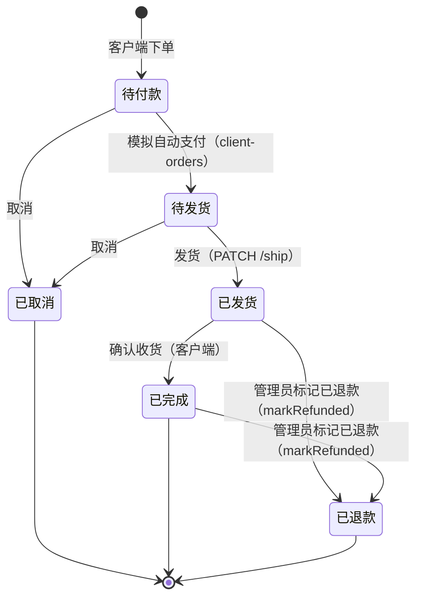
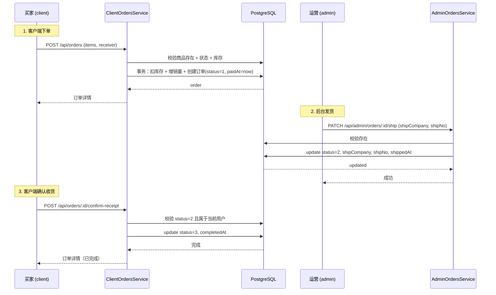
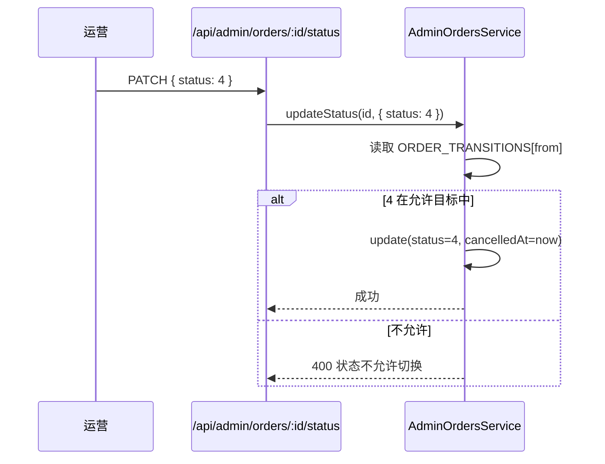

# 06 订单管理

> 后台订单全流程：列表、详情、状态机切换、发货、查看退款申请入口。

## 1. 模块定位

后台运营处理订单的核心模块。覆盖：

- 多状态筛选 + 关键字搜索（订单号 / 用户名）
- 订单详情（含收货人反序列化、商品快照）
- 状态切换（按状态机走）
- 发货（录入物流）
- 退款申请入口（数据已建，UI 在 Phase 2）

## 2. 涉及数据表

| 表 | 用途 |
| --- | --- |
| `orders` | 订单主体 |
| `order_items` | 订单商品快照（含 `productTitle` / `productCover` / `price`） |
| `users` | 关联用户信息 |
| `refund_requests` | 退款申请（详情页可查看，编辑 UI 在 Phase 2） |

详见 `10-服务端/03-数据库Schema说明.md`。

## 3. Server 接口清单

文件：`server/src/admin-orders/`

| 方法 | 路径 | 权限 | 说明 |
| --- | --- | --- | --- |
| `GET` | `/api/admin/orders` | `order:list` | 列表（状态筛选 + 关键字搜索 + 分页） |
| `GET` | `/api/admin/orders/:id` | `order:detail` | 详情（含收货人反序列化） |
| `PATCH` | `/api/admin/orders/:id/status` | `order:cancel` | 通用状态切换（沿状态机） |
| `PATCH` | `/api/admin/orders/:id/ship` | `order:ship` | 发货（写入 shipCompany / shipNo + shippedAt） |

### 查询 DTO（`admin-orders/dto/order.dto.ts`）

```ts
export const ORDER_STATUSES = [0, 1, 2, 3, 4, 5] as const
export type OrderStatus = (typeof ORDER_STATUSES)[number]

export const ORDER_STATUS_LABELS: Record<OrderStatus, string> = {
  0: '待付款', 1: '待发货', 2: '已发货',
  3: '已完成', 4: '已取消', 5: '已退款'
}

export const ORDER_TRANSITIONS: Record<OrderStatus, OrderStatus[]> = {
  0: [1, 4],   // PENDING  → PAID / CANCELLED
  1: [2, 4],   // PAID     → SHIPPED / CANCELLED
  2: [3, 5],   // SHIPPED  → COMPLETED / REFUNDED
  3: [5],      // COMPLETED → REFUNDED
  4: [],       // CANCELLED → 终态
  5: []        // REFUNDED → 终态
}
```

> 状态 5（REFUNDED）由 `AdminRefundsService.markRefunded` 在事务内写入，同时写 `orders.refunded_at`。前端 `admin/src/api/admin-orders.ts` 已同步 6 个状态枚举与标签。

export class QueryOrderDto {
  @IsOptional() @Type(() => Number) @IsIn(ORDER_STATUSES as unknown as number[]) status?: OrderStatus
  @IsOptional() @IsString() @MaxLength(64) keyword?: string
  @IsOptional() @Type(() => Number) @IsInt() @Min(1) page?: number = 1
  @IsOptional() @Type(() => Number) @IsInt() @Min(1) pageSize?: number = 10
}
```

关键字搜索行为（`AdminOrdersService.list`）：

- 全数字 → 解释为 `Order.id` 精确匹配
- 否则 → 按 `user.username` 模糊（`contains, mode: 'insensitive'`）

### 详情字段

`AdminOrdersService.findOne` 返回结构（在 `Order` 基础上）：

- `user: { id, username, nickname, phone }`
- `items: [{ id, productId, productTitle, productCover, price, quantity }]`
- `receiver: { name, phone, address }`（从 `Json` 字段反序列化）

## 4. 状态机（核心）



> 客户端下单即视为「已支付」——演示版跳过真实支付环节。`ClientOrdersService.create` 在事务中创建订单时直接 `status: 1, paidAt: new Date()`。

### 状态机的代码实现

```ts
// AdminOrdersService.updateStatus
async updateStatus(id: number, dto: UpdateOrderStatusDto) {
  const order = await this.prisma.order.findUnique({ where: { id } })
  if (!order) throw new NotFoundException('订单不存在')

  const from = order.status as OrderStatus
  const to = dto.status
  const allowed = ORDER_TRANSITIONS[from] ?? []
  if (!allowed.includes(to)) {
    throw new BadRequestException(`订单状态不允许从 ${from} 切换到 ${to}`)
  }

  const data: Prisma.OrderUpdateInput = { status: to }
  const now = new Date()
  if (to === 1) data.paidAt = now
  if (to === 3) data.completedAt = now
  if (to === 4) data.cancelledAt = now

  return this.prisma.order.update({ where: { id }, data })
}
```

### 发货（独立方法）

```ts
// AdminOrdersService.ship
async ship(id: number, dto: ShipOrderDto) {
  const order = await this.prisma.order.findUnique({ where: { id } })
  if (!order) throw new NotFoundException('订单不存在')

  const from = order.status as OrderStatus
  if (from === 1) {
    return this.prisma.order.update({
      where: { id },
      data: {
        status: 2,
        shipCompany: dto.shipCompany,
        shipNo: dto.shipNo,
        shippedAt: new Date()
      }
    })
  }
  if (from === 2) {
    // 已发货：允许覆盖运单（客服改单）
    return this.prisma.order.update({
      where: { id },
      data: { shipCompany: dto.shipCompany, shipNo: dto.shipNo }
    })
  }
  throw new BadRequestException(`当前状态（${from}）不可发货`)
}
```

> 已发货状态下再调 `/ship` 是允许的（仅覆盖运单号，不动状态）。其他状态调 `/ship` 抛 400。

## 5. Admin 路由与页面

- **路由**：`/orders`
- **权限**：`order:list`（路由）+ 详情 / 取消 / 发货按钮的 `v-permission`
- **文件**：`admin/src/views/OrderListView.vue`

### 列表

字段：

| 列 | 字段 |
| --- | --- |
| 订单号 | `orderNo` |
| 用户 | `user.username` / `user.nickname` |
| 金额 | `totalAmount` |
| 商品数 | `itemCount` |
| 状态 | `status`（el-tag，颜色见 `ORDER_STATUS_TAG_TYPE`） |
| 创建时间 | `createdAt` |
| 操作 | 详情 / 取消 / 发货 |

筛选：

- 状态下拉（全部 / 待付款 / 待发货 / 已发货 / 已完成 / 已取消）
- 关键字搜索（订单号 / 用户名）

### 详情 Drawer

- 订单基本信息
- 收货人（`receiver` 三段）
- 商品列表（`items`，每行：封面 + 标题 + 单价 + 数量 + 小计）
- 状态流转记录（`paidAt` / `shippedAt` / `completedAt` / `cancelledAt`）
- 运单信息（`shipCompany` / `shipNo`）

### 取消订单

- 当前状态 = 0 / 1 时可取消
- 调 `PATCH /api/admin/orders/:id/status`，body `{ status: 4 }`
- 服务端校验 `ORDER_TRANSITIONS`

### 发货

- 当前状态 = 1 时可发货
- 弹 Dialog：物流公司 + 物流单号 → 调 `PATCH /api/admin/orders/:id/ship`
- 当前状态 = 2 时：弹同一 Dialog，仅修改运单（不改状态）

## 6. 关键流程

### 端到端下单链路



### 取消订单



## 7. 权限点

| 权限码 | 用途 |
| --- | --- |
| `order:list` | 列表 / 路由 |
| `order:detail` | 详情接口 + 详情 Drawer |
| `order:ship` | 发货接口 + 发货按钮 |
| `order:cancel` | 取消接口 + 取消按钮 |

`ADMIN` 角色默认包含 `list / detail / ship`；**不包含** `cancel`（仅 `SUPER_ADMIN` 可取消）。

> ⚠️ `order:cancel` 路由装饰器挂的是 `PATCH /:id/status`，权限码语义是「取消」。但该接口理论上可切换到状态机允许的所有目标状态——这是当前实现的轻微权限语义扩散，生产化阶段建议拆接口或加更严格的参数校验。

## 8. 退款申请入口

`refund_requests` 表已建（Phase 1 同步），订单详情页可读 `Order.refund` 关联。**列表 / 审批 UI 在 Phase 2**（见 `11-退款与售后.md`）。

当前阶段：

- `RefundRequest.status` 枚举（建议）：`0` 待审 / `1` 已批准 / `2` 已拒绝 / `3` 已退款
- 客户端未提供「申请退款」入口（roadmap 标记 client 端后做）


## 导出 Excel

> 顶部「导出 Excel」按钮（`v-permission="`export:xxx`"`）按当前列表筛选条件调 `server/src/admin-exports/`：
>
> - 订单列表：`GET /api/admin/exports/orders`（权限 `export:orders`）
> - 商品列表：`GET /api/admin/exports/products`（权限 `export:products`）
> - 库存流水：`GET /api/admin/exports/inventory-logs`（权限 `export:inventory_logs`）
>
> 服务端用 `xlsx`（SheetJS）生成二进制 Buffer，`StreamableFile` 流式返回，文件名为 `xxx_YYYYMMDD-HHmm.xlsx`。
>
> 详见 `20-管理后台/12-数据导出.md`。


## 9. 相关文档

- 接口定义 / 状态机表：`10-服务端/02-模块总览.md`
- 数据表：`10-服务端/03-数据库Schema说明.md`
- 客户端下单流程：`30-移动端/04-核心业务流程.md`
- 退款 UI（Phase 2）：`11-退款与售后.md`
