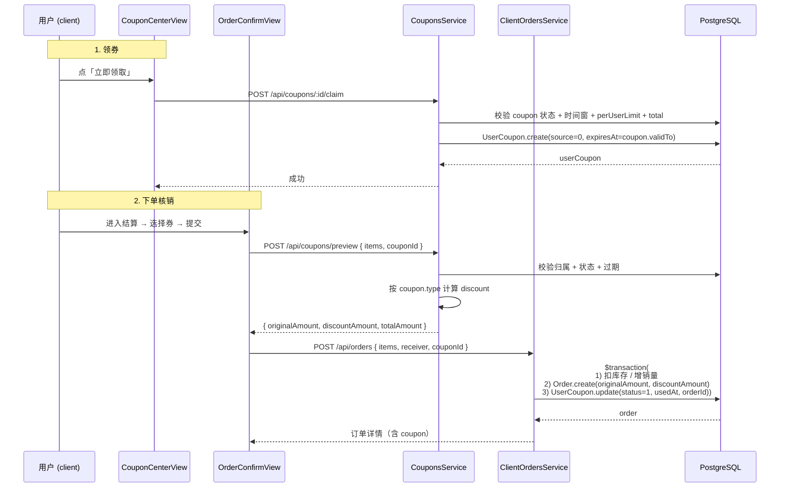
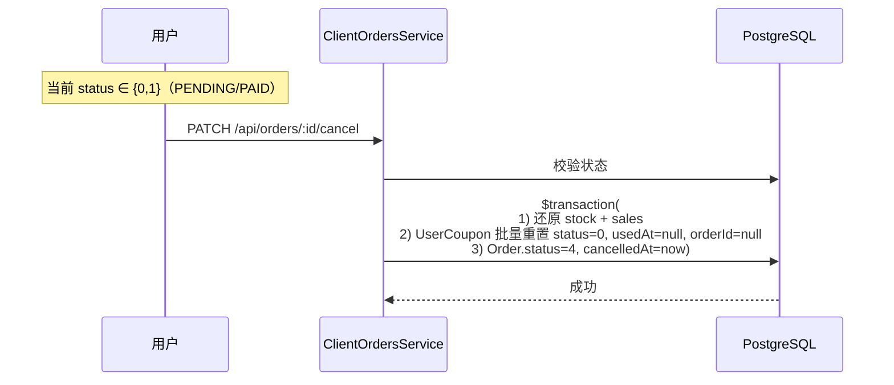
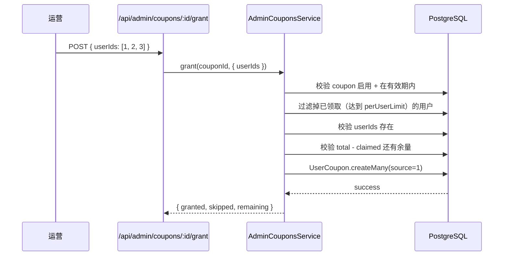

# 08 优惠券与促销

> Phase 2 第一个上线的业务模块。覆盖优惠券定义（满减 / 折扣 / 无门槛）、用户领取、订单核销、后台发放、领取明细。

## 1. 模块定位

运营通过后台创建优惠券（限时 / 限量 / 限人 / 限门槛），前台用户领取后在下单页选择使用，系统按优惠券规则计算折扣并核销。本模块不处理退款 / 退券（与 `11-退款与售后.md` 联动，详见第 7 节）。

涉及三个角色：

- **运营（admin）**：创建 / 编辑 / 启停 / 删除优惠券，手动发放给指定用户，查看领取明细
- **用户（client）**：浏览可领取优惠券、主动领取、查看自己的券、下单时选择并使用
- **系统**：下单成功后自动核销（标记 UserCoupon 为已使用 + 绑定 orderId），取消订单时自动退券

## 2. 涉及数据表

| 表 | 用途 |
| --- | --- |
| `coupons` | 优惠券定义（名称 / 类型 / 门槛 / 面值 / 有效期 / 总量 / 每人限领 / 状态） |
| `user_coupons` | 用户领券记录（来源 / 状态 / 核销时间 / 关联订单） |
| `orders` | 加了 `original_amount` / `discount_amount` 两个 Decimal 字段，记录折扣前金额与优惠金额 |

字段细节见 `10-服务端/03-数据库Schema说明.md` 第 3 节新增的三张表 / 两列。

### 枚举约定

| 字段 | 值 |
| --- | --- |
| `coupons.type` | `1` 满减 / `2` 折扣 / `3` 无门槛 |
| `user_coupons.status` | `0` 未使用 / `1` 已使用 / `2` 已过期 |
| `user_coupons.source` | `0` 主动领取 / `1` 后台发放 / `2` 系统自动（保留） |
| `orders.coupon_id`（隐式） | 通过 `user_coupons.order_id` 反查 |

`coupons.amount` 按 `type` 解释：
- `type=1` 满减：`amount` 元（满 `threshold` 减 `amount` 元）
- `type=2` 折扣：`amount` 百分比（如 `85.50` = 8.55 折）
- `type=3` 无门槛：`amount` 元（直接减 `amount` 元代金）

`type=1 / 2` 时 `threshold` 必填且 > 0；`type=3` 时 `threshold` 不消费（即便填了也忽略）。

## 3. Server 接口清单

### 3.1 后台接口

文件：`server/src/admin-coupons/`，全局前缀 `/api/admin`，**全部走 `PermissionsGuard`**，每个端点挂 `@RequirePermission` 装饰器。

| 方法 | 路径 | 权限码 | 说明 |
| --- | --- | --- | --- |
| `GET` | `/api/admin/coupons` | `coupon:list` | 列表（keyword 模糊 + status + type 筛选 + 分页；返回每条 `claimed` 实时计数） |
| `GET` | `/api/admin/coupons/:id` | `coupon:list` | 详情（含 `claimed`） |
| `POST` | `/api/admin/coupons` | `coupon:create` | 创建 |
| `PATCH` | `/api/admin/coupons/:id` | `coupon:edit` | 更新（部分字段） |
| `PATCH` | `/api/admin/coupons/:id/status` | `coupon:on_off` | 启停（body `{ status: 0 \| 1 }`） |
| `DELETE` | `/api/admin/coupons/:id` | `coupon:delete` | 删除（已有领取记录时拒绝） |
| `GET` | `/api/admin/coupons/:id/claims` | `coupon:list` | 领取明细（status / source 筛选 + 分页 + 用户信息） |
| `POST` | `/api/admin/coupons/:id/grant` | `coupon:grant` | 手动发放 body `{ userIds: number[] }` |

### 3.2 前台接口

文件：`server/src/coupons/`，全局前缀 `/api`，**所有端点走 `JwtAuthGuard`**。

| 方法 | 路径 | 说明 |
| --- | --- | --- |
| `GET` | `/api/coupons/available` | 当前可领取优惠券（含 `claimed` / `remaining` / `received`） |
| `POST` | `/api/coupons/:id/claim` | 用户主动领取 |
| `GET` | `/api/coupons/mine?status=0\|1\|2` | 我的优惠券（status 默认 0 未使用 + 未过期） |
| `POST` | `/api/coupons/preview` | 下单前试算 body `{ items, couponId? }`，返回 `{ originalAmount, discountAmount, totalAmount, coupon }` |

> 注意：前台接口的 `couponId` 参数都是 `UserCoupon.id`，不是 `Coupon.id`。同一张 Coupon 定义被多个用户领取后产生多个 UserCoupon 实例，核销要锁到具体那一行。

### 3.3 订单核销

文件：`server/src/client-orders/`

- `POST /api/orders` body 新增 `couponId?: number`（仍然接收 `UserCoupon.id`）
- `ClientOrdersService.create` 在事务里：
  1. 验商品 / 库存（同 Phase 1）
  2. 调 `CouponsService.resolveDiscount(userId, couponId, originalAmount)` 拿到 `discountAmount` + `userCouponId`
  3. 算 `totalAmount = max(0, originalAmount - discountAmount)`
  4. 事务内 `Order.create({ ..., originalAmount, discountAmount })` → `UserCoupon.update({ status: 1, usedAt, orderId })`
- `ClientOrdersService.cancel` 在事务内：
  - 回滚 stock / sales（同 Phase 1）
  - 把订单关联的所有 `UserCoupon` 恢复成 `status: 0, usedAt: null, orderId: null`（**仅 status ∈ {0,1} 的订单可取消，所以这段总是会跑**）

## 4. Admin 路由与页面

| 路由 | 文件 | 说明 |
| --- | --- | --- |
| `/coupons` | `admin/src/views/CouponListView.vue` | 主列表 + 表单 + 启停 + 删除 + 手动发放入口 |
| `/coupons/:id/claims` | `admin/src/views/CouponClaimsView.vue` | 领取明细二级页（含优惠券信息卡片 + 用户领取记录表） |

API 文件：`admin/src/api/admin-coupons.ts`（按命名规则与 `admin-banners.ts` 对齐）。

### 列表页字段

| 列 | 字段 | 备注 |
| --- | --- | --- |
| ID | `id` | |
| 名称 | `name` | 超长省略 |
| 类型 | `type` | tag：满减 / 折扣 / 无门槛 |
| 门槛 | `threshold` | 无门槛类型显示「无」 |
| 面值 | `amount` | 折扣类型显示 `85%`；其他显示 `¥X.XX` |
| 有效期 | `validFrom` / `validTo` | 同行显示「开始 至 结束」 |
| 已领 / 总量 | `claimed` / `total` | 实时聚合（`groupBy` `_count`） |
| 状态 | `status` | tag：启用 / 停用 |

筛选：`keyword`（name / description 模糊）+ `status` + `type`。

操作列：编辑 / 启停 / 领取明细 / 手动发放 / 删除（每个按钮挂 `v-permission`）。

### 表单弹窗

- 名称（必填，128 字内）
- 类型（radio：满减 / 折扣 / 无门槛）—— 切换时联动门槛字段显隐
- 门槛（type=1/2 时必填；无门槛类型隐藏）
- 面值（必填；折扣类型 step=0.5，其他 step=5；折扣类型校验 `< 100`）
- 总量（≥1）
- 每人限领（≥1 且 ≤ 总量）
- 有效期（el-date-picker daterange，必填且 validFrom < validTo）
- 描述（textarea，1000 字内）
- 启用（switch）

### 手动发放弹窗

- 用户多选（el-select multiple + filterable，options 从 `/api/admin/users` 取）
- 提交后展示「已发放 X 张，跳过 Y 人（剩余 Z）」

## 5. 关键流程

### 5.1 领券 + 下单核销



### 5.2 取消订单退券



### 5.3 后台手动发放



## 6. 权限点

| 权限码 | 用途 | ADMIN 默认 |
| --- | --- | --- |
| `coupon:list` | 列表 / 详情 / 领取明细 + 路由 meta | ✓ |
| `coupon:create` | 新建优惠券 | ✓ |
| `coupon:edit` | 编辑优惠券 | ✓ |
| `coupon:on_off` | 启停优惠券 | ✓ |
| `coupon:delete` | 删除优惠券 | ✓ |
| `coupon:grant` | 手动发放 + 手动发放按钮 | ✓ |

`SUPER_ADMIN` 走通配 `*` 自动放行所有权限。

`SUPER_ADMIN_PERMISSIONS` 不变（`['*']`）；`ADMIN_PERMISSIONS` 在 `server/prisma/seed.ts` 中新增上述 6 个码。重跑 `npm run prisma:seed` 后 `operator` 账号自动获得。

## 7. 退款 / 退券（与 11-退款与售后.md 联动）

当前 Phase 2 / 2.1 范围内**未实现**退款 / 退券：

- 退款模块（2.4）若要支持「退款时退券」，需要在 `RefundRequest.status` 流转到 `REFUNDED` 时同步把 `UserCoupon` 退回到 `未使用`
- 「已发货后退款」场景比较复杂（券已被绑定到订单且订单状态无法直接回到 4 CANCELLED），建议 2.4 阶段设计状态机时再决定

本模块在订单状态流转上做了预留：

- `Order.coupons UserCoupon[]`（1:N 反向导航）
- `UserCoupon.orderId Int? @unique`（确保一张券只能绑定一个订单）
- `client-orders/service.ts` 的 cancel 已实现 0/1 状态的自动退券

## 8. 字段规则速查

### 创建 / 更新优惠券（CreateCouponDto / UpdateCouponDto）

| 字段 | 类型 | 必填 | 校验 |
| --- | --- | --- | --- |
| `name` | string | 是 | 1–128 字 |
| `type` | 1 \| 2 \| 3 | 是 | enum |
| `threshold` | number? | 否（type=3 时忽略） | ≥ 0 |
| `amount` | number | 是 | ≥ 0；type=2 时必须 < 100 |
| `description` | string? | 否 | 0–1000 字 |
| `validFrom` / `validTo` | ISO datetime | 是 | validFrom < validTo |
| `total` | int | 是 | ≥ 1 |
| `perUserLimit` | int | 否 | 默认 1，1–total |
| `status` | 0 \| 1 | 否 | 默认 1 |

### 试算 / 核销返回（PreviewResult / OrderCouponInfo）

```ts
interface PreviewResult {
  originalAmount: number
  discountAmount: number   // 已四舍五入到分，不超过 originalAmount
  totalAmount: number
  coupon: {
    id: number             // Coupon.id
    name: string
    type: number
    threshold: number | null
    amount: number         // 单位同 Coupon.amount
  } | null
}

interface OrderCouponInfo {
  userCouponId: number     // UserCoupon.id（订单里看到的）
  couponId: number
  name: string
  type: number
  amount: number
}
```

## 9. 相关文档

- 服务端模块清单：`10-服务端/02-模块总览.md`
- 数据表结构：`10-服务端/03-数据库Schema说明.md`
- 认证 / 权限码体系：`10-服务端/04-认证与权限体系.md`
- 客户端下单流程：`30-移动端/04-核心业务流程.md`
- 退款模块（联动）：`20-管理后台/11-退款与售后.md`（2.4 待补）
