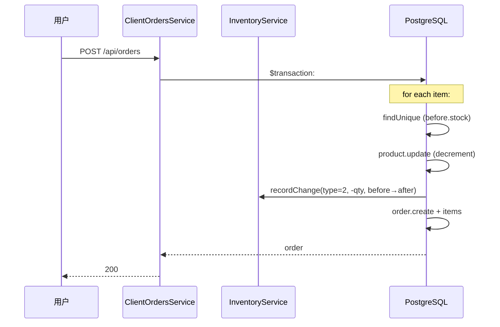
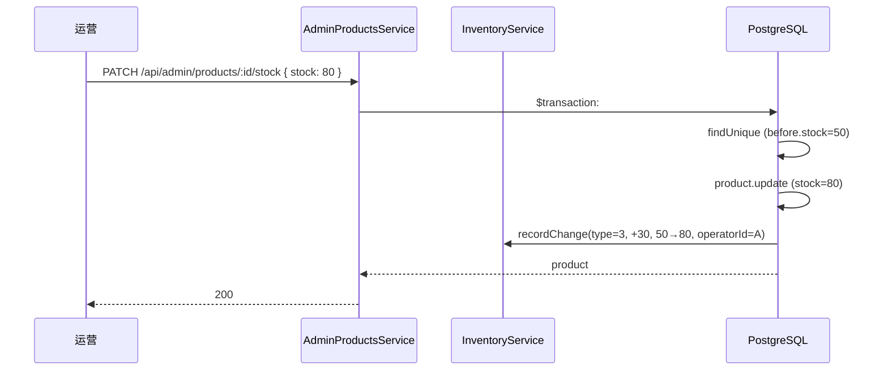

# 09 库存预警

> Phase 2 / 2.2 模块。新增 `Product.threshold` 字段 + `InventoryLog` 表 + 公共 `InventoryService`，统一所有库存变更的流水写入。

## 1. 模块定位

运营设置每个商品的库存预警阈值，系统实时统计当前 `stock <= threshold` 的上架商品作为预警列表。所有库存变更（出库 / 退款入库 / 取消退库 / 后台调整）都写流水，方便回溯谁、何时、改了多少。

涉及三个角色：

- **运营（admin）**：在 `/inventory/warnings` 设置阈值、在 `/inventory/logs` 查询流水
- **用户（client）**：本模块对客户端透明；下单扣减 / 取消退库会自动写流水
- **系统**：通过 `InventoryService.recordChange(tx, ...)` 在事务内写流水

## 2. 涉及数据表

### 增量字段：`products.threshold`

| 字段 | 类型 | 说明 |
| --- | --- | --- |
| `threshold` | `Int @default(10)` | 库存预警阈值，默认 10 |

### 新表：`inventory_logs`

| 字段 | 类型 | 说明 |
| --- | --- | --- |
| `id` | `Int` PK | 自增 |
| `product_id` | `Int` FK → `products.id` | 商品 |
| `type` | `Int` | 流水类型（见下表） |
| `quantity` | `Int` | 变更数量，可正可负；正=入库，负=出库 |
| `reason` | `String?` | 业务原因，如「订单 X 出库」 |
| `operator_id` | `Int?` FK → `admin_users.id` | 操作人；客户端自动行为写 null |
| `before_stock` / `after_stock` | `Int` | 变更前 / 后库存快照 |
| `created_at` | `DateTime` | 标准审计 |

索引：

- `@@index([productId, createdAt])` —— 单商品历史轨迹
- `@@index([type, createdAt])` —— 按类型筛选

`Product` / `AdminUser` 各加 `inventoryLogs InventoryLog[]` 反向关联。

### 枚举：`type`

| code | 名称 | 触发场景 | operator |
| --- | --- | --- | --- |
| `1` INBOUND | 入库 | 预留，本期无 UI 入口 | - |
| `2` OUTBOUND | 出库 | 客户端下单成功扣库存 | null（系统） |
| `3` ADJUST | 调整 | 后台 `PATCH /api/admin/products/:id/stock` | admin |
| `4` REFUND_IN | 退款入库 | admin 标记已退款 | admin |
| `5` CANCEL_IN | 取消退库 | 用户取消订单 | null（系统） |

> 取消与退款语义不同：取消是用户主动放弃未发货订单，退库不带业务约束；退款是售后行为，运营操作。分两个 type 方便审计。

## 3. Server 设计

### 3.1 公共封装：`InventoryService.recordChange`

`server/src/inventory/inventory.service.ts` 提供唯一入口：

```ts
recordChange(
  tx: Prisma.TransactionClient,
  params: {
    productId, type, quantity, beforeStock, afterStock,
    reason?, operatorId?
  }
): Promise<void>
```

所有改 `stock` 的调用方必须按以下范式：

```ts
const before = await tx.product.findUnique({ where: { id }, select: { stock: true } })
const after = await tx.product.update({ where: { id }, data: { stock: { decrement: qty } } })
await this.inventory.recordChange(tx, {
  productId: id, type: 2, quantity: -qty,
  beforeStock: before.stock, afterStock: after.stock,
  reason: `订单 ${orderNo} 出库`
})
```

事务边界：所有库存变更和流水写入必须在同一个 `$transaction` 内，避免主流程成功但无流水（或反之）。

### 3.2 库存变更点切换

| 位置 | 切换前 | 切换后 |
| --- | --- | --- |
| `admin-products.adjustStock` | 直接 `update { stock }` | 算 diff → `recordChange(type=3, operatorId)` |
| `client-orders.createOrder` | 内联 `decrement stock` | `recordChange(type=2, -qty, reason="订单 X 出库")` |
| `client-orders.cancel` | 内联 `increment stock` | `recordChange(type=5, +qty, reason="订单 X 取消退库")` |
| `admin-refunds.markRefunded` | 内联 `increment stock` | `recordChange(type=4, +qty, reason="退款 #X 入库", operatorId)` |

`admin-products.controller` 和 `admin-refunds.controller` 通过 `@Req() req` 取 `req.user.sub` 作为 operatorId。

### 3.3 后台接口：`server/src/admin-inventory/`

| 方法 | 路径 | 权限码 | 说明 |
| --- | --- | --- | --- |
| `GET` | `/api/admin/inventory/logs?productId&type&keyword&page&pageSize` | `inventory:list` | 流水查询（keyword 命中 product.title） |
| `GET` | `/api/admin/inventory/warnings` | `inventory:warning` | 预警商品列表（status=1 上架 + stock<=threshold），按缺口降序 |
| `PATCH` | `/api/admin/inventory/products/:id/threshold` | `inventory:warning` | 设置单商品阈值 |

### 3.4 Dashboard 扩展

`AdminDashboardService.overview()` 返回加：

- `lowStockCount`：当前预警商品数
- `lowStockProducts`：Top 5（按缺口降序），含 `id / title / cover / stock / threshold`

前端 `DashboardView.vue` 同步加 1 张「库存预警」KPI 卡片 + 1 个 Top 5 列表。

## 4. Admin 路由与页面

| 路由 | 文件 | 说明 |
| --- | --- | --- |
| `/inventory/warnings` | `admin/src/views/InventoryWarningListView.vue` | 预警商品列表 + 行内 el-input-number 设置阈值 |
| `/inventory/logs` | `admin/src/views/InventoryLogListView.vue` | 流水列表（类型 tab + 关键字 + 分页） |
| `/dashboard` | `admin/src/views/DashboardView.vue`（改动） | 新增库存预警 KPI 卡片 + Top 5 列表 |

API 文件：`admin/src/api/admin-inventory.ts`，与 `admin-refunds.ts` 同风格。

### 预警列表字段

| 列 | 字段 |
| --- | --- |
| 商品 | `cover + title`（带缩略图） |
| 当前库存 | `stock`（红色） |
| 阈值 | 行内 `el-input-number`，可改后「保存阈值」 |
| 缺口 | `threshold - stock`（橙色） |

### 流水列表字段

| 列 | 字段 |
| --- | --- |
| ID | `id` |
| 商品 | `product.cover + title` |
| 类型 | `type`（success / warning / info / primary 四种 tag） |
| 变更数量 | `quantity`（正数绿色 / 负数红色，带 `+/-` 前缀） |
| 变更前 / 后 | `beforeStock → afterStock` |
| 原因 | `reason`（超长省略） |
| 操作人 | `operator.nickname ?? username` 或「系统」 |
| 时间 | `createdAt` |

筛选：类型 tab（全部 / 入库 / 出库 / 调整 / 退款入库 / 取消退库）+ 关键字（商品标题）。

## 5. 关键流程

### 5.1 下单扣库存（出库）



### 5.2 后台调整库存



### 5.3 取消 / 退款退库

两种场景都走同一范式（找 before → update → recordChange），区别只在 type：

- 取消：`type=5 CANCEL_IN`，operator=null，reason=「订单 X 取消退库」
- 退款：`type=4 REFUND_IN`，operator=admin sub，reason=「退款 #X 入库」

## 6. 权限点

| 权限码 | 用途 | ADMIN 默认 |
| --- | --- | --- |
| `inventory:list` | 流水查询页 + 接口 | ✓ |
| `inventory:warning` | 预警列表 + 阈值设置 + 接口 | ✓ |

`types.ts` 中占位的 `inventory:*` 通配已展开为以上两个具体权限。

Dashboard 卡片点击通过 `dashboard:view` 路由 meta 放行（无需新增权限）。

## 7. 演示版简化

- **INBOUND（type=1）**无 UI 入口，预留待后续手动入库功能
- **历史订单无流水**：seed 直接插入订单，未跑 `createOrder`，所以历史订单没库存流水。运行时新增订单 / 取消 / 退款 会自动写
- **库存预警**只覆盖 status=1 上架商品，下架商品不进预警
- **adjustStock 写绝对值**：传 `stock=80` 表示「把库存改成 80」，diff = 80 - before；不传「调整多少」

## 8. 关联

- `client-orders.createOrder` 调用本服务写 type=2 出库
- `client-orders.cancel` 调用本服务写 type=5 取消退库
- `admin-refunds.markRefunded` 调用本服务写 type=4 退款入库
- `admin-products.adjustStock` 调用本服务写 type=3 调整


## 导出 Excel

> 顶部「导出 Excel」按钮（`v-permission="`export:xxx`"`）按当前列表筛选条件调 `server/src/admin-exports/`：
>
> - 订单列表：`GET /api/admin/exports/orders`（权限 `export:orders`）
> - 商品列表：`GET /api/admin/exports/products`（权限 `export:products`）
> - 库存流水：`GET /api/admin/exports/inventory-logs`（权限 `export:inventory_logs`）
>
> 服务端用 `xlsx`（SheetJS）生成二进制 Buffer，`StreamableFile` 流式返回，文件名为 `xxx_YYYYMMDD-HHmm.xlsx`。
>
> 详见 `20-管理后台/12-数据导出.md`。


## 9. 相关文档

- 服务端模块清单：`10-服务端/02-模块总览.md`
- 数据表结构：`10-服务端/03-数据库Schema说明.md`
- Dashboard 设计：`20-管理后台/03-仪表盘.md`
- 退款文档（库存联动源头）：`20-管理后台/11-退款与售后.md`
