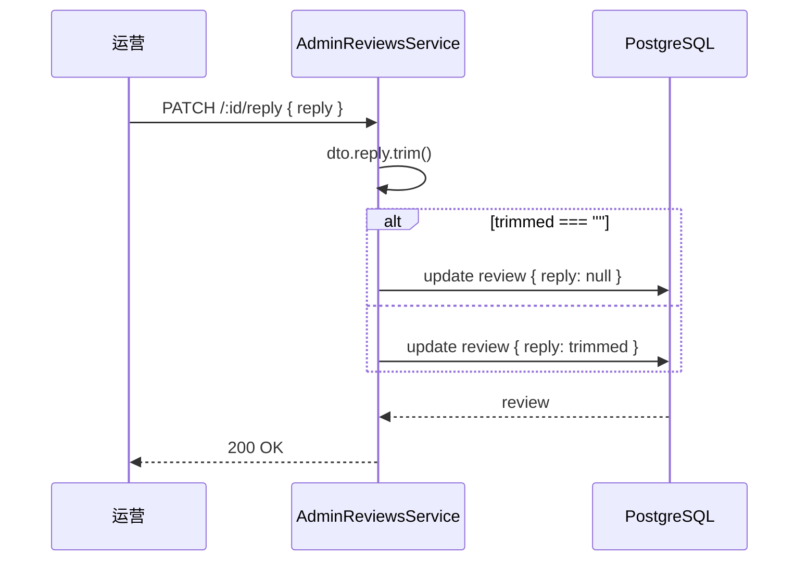

# 10 评价管理

> Phase 2 / 2.3 模块。新增 `Review` 表 + 后台审核 / 回复能力。客户端评价入口留待 2.5 之后补，本轮用 seed 写入 demo 数据。

## 1. 模块定位

运营对客户端用户提交的商品评价进行审核，可批准、屏蔽、恢复，并撰写商家回复。

涉及三个角色：

- **用户（client）**：在订单完成后对商品写评价（含 1~5 星 + 内容 + 图片），本轮入口留后做
- **运营（admin）**：在 `/reviews` 列表筛选 / 审核 / 回复
- **系统**：状态机校验合法切换；回复支持「空串 = 清除」

## 2. 涉及数据表

### 新增 `reviews`

| 字段 | 类型 | 说明 |
| --- | --- | --- |
| `id` | `Int` PK | 自增 |
| `product_id` | `Int` FK → `products.id` | 关联商品（Restrict） |
| `user_id` | `Int` FK → `users.id` | 评价用户（Restrict） |
| `rating` | `Int` | 1~5 整数星 |
| `content` | `Text` | 评价正文 |
| `images` | `String[]` | 图集，Postgres `text[]` |
| `status` | `Int` | 0 待审 / 1 已通过 / 2 已屏蔽（默认 0） |
| `reply` | `Text?` | 商家回复，可空；空串语义为「清除回复」 |
| `created_at` / `updated_at` | `DateTime` | 标准审计 |

索引：

- `@@index([productId, status])` —— 商品详情聚合查询「已通过的评价」
- `@@index([userId])` —— 我的评价
- `@@index([status])` —— 后台列表按状态筛选

不关联 `OrderItem`：演示版简化，按「任一已付款订单即可评价」处理，避免 schema 过度耦合（若后续要做「仅购买过才可评」，再追加 `orderItemId` 字段 + 校验）。

`User` / `Product` 各加 `reviews Review[]` 反向关联。

### 枚举：`status`

| code | 含义 |
| --- | --- |
| `0` PENDING | 待审（默认） |
| `1` APPROVED | 已通过（客户端可见） |
| `2` BLOCKED | 已屏蔽（客户端不可见） |

### 状态机

```ts
export const REVIEW_TRANSITIONS: Record<ReviewStatus, ReviewStatus[]> = {
  0: [1, 2],   // PENDING  → APPROVED / BLOCKED
  1: [2],      // APPROVED → BLOCKED
  2: [1]       // BLOCKED  → APPROVED（恢复）
}
```

PENDING 可直接 BLOCKED；APPROVED → APPROVED（自切换）不允许；BLOCKED 是终态但允许恢复为 APPROVED。

## 3. Server 接口清单

### 后台接口（`server/src/admin-reviews/`）

| 方法 | 路径 | 权限码 | 说明 |
| --- | --- | --- | --- |
| `GET` | `/api/admin/reviews?status=&rating=&keyword=&page=&pageSize=` | `review:list` | 列表（状态 / 评分 / 关键字 + 分页） |
| `GET` | `/api/admin/reviews/:id` | `review:detail` | 详情（含 product / user） |
| `PATCH` | `/api/admin/reviews/:id/approve` | `review:approve` | 通过（PENDING/BLOCKED → APPROVED） |
| `PATCH` | `/api/admin/reviews/:id/block` | `review:block` | 屏蔽（PENDING/APPROVED → BLOCKED） |
| `PATCH` | `/api/admin/reviews/:id/reply` | `review:reply` | 写回复（空串视为清除） |

控制器位于 `server/src/admin-reviews/admin-reviews.controller.ts`，全局 `PermissionsGuard` 校验权限码。

### 列表查询（`QueryReviewDto`）

```ts
class QueryReviewDto {
  status?: 0 | 1 | 2
  rating?: 1 | 2 | 3 | 4 | 5
  keyword?: string  // 命中 content / user.username / product.title（mode=insensitive）
  page?: number     // 默认 1
  pageSize?: number // 默认 10
}
```

### 回复语义

`ReplyReviewDto.reply` 字段：

- 非空字符串 → `update { reply: trimmed }`
- 空字符串 / 全空白 → `update { reply: null }`（清除）

长度上限 1000 字符。

## 4. Admin 路由与页面

| 路由 | 文件 | 说明 |
| --- | --- | --- |
| `/reviews` | `admin/src/views/ReviewListView.vue` | 主列表（状态 tab + 评分 tab + 关键字 + 分页） |
| `/reviews/:id` | `admin/src/views/ReviewDetailView.vue` | 详情 + 审核（通过 / 屏蔽 / 恢复 / 写回复） |

API 文件：`admin/src/api/admin-reviews.ts`，与 `admin-refunds.ts` 同风格。

### 列表字段

| 列 | 字段 |
| --- | --- |
| ID | `id` |
| 商品 | `product.cover` + `product.title`（带缩略图） |
| 用户 | `user.nickname ?? user.username` + `@username` |
| 评分 | `rating` 用 ★ / ☆ unicode（1~5）展示 |
| 内容 | `content`（超长省略）+ 「（已回复）」 角标 |
| 图片 | `images.length`（如 0 显示 -） |
| 状态 | `status`（warning / success / info 三种 tag） |
| 提交时间 | `createdAt` |

筛选：状态 tab（全部 / 待审 / 已通过 / 已屏蔽）+ 评分 tab（全部 / 1~5 星）+ 关键字（评价内容 / 商品标题 / 用户名）。

### 详情页

- 基本信息：id / 评分 / 提交时间 / 更新时间
- 评价用户：id / 用户名 + 昵称 / 手机号
- 商品信息：封面 + 标题 + 商品 ID
- 评价内容 + 图片（el-image 缩略图，点击放大预览）
- 商家回复（空时显示「暂无回复」）
- 按钮区：
  - 状态 0：通过 / 屏蔽
  - 状态 1：屏蔽
  - 状态 2：恢复为通过
  - 任意状态：写回复 / 编辑回复（弹 dialog，textarea，留空保存 = 清除）

## 5. 关键流程

### 5.1 状态机校验

```ts
private assertTransition(from: number, to: ReviewStatus) {
  const allowed = REVIEW_TRANSITIONS[from as ReviewStatus] ?? []
  if (!allowed.includes(to)) {
    throw new BadRequestException(`评价状态不允许从 ${from} 切换到 ${to}`)
  }
}
```

每个 mutating 端点（`approve` / `block`）先 `findOne` 拿到当前 status，再 `assertTransition`，跨级跳一律 400。

### 5.2 回复 / 清除回复



## 6. 权限点

| 权限码 | 用途 | ADMIN 默认 |
| --- | --- | --- |
| `review:list` | 列表 / 路由 meta | ✓ |
| `review:detail` | 详情接口 + 路由 meta | ✓ |
| `review:approve` | 通过 / 恢复按钮 + 接口 | ✓ |
| `review:block` | 屏蔽按钮 + 接口 | ✓ |
| `review:reply` | 写回复 / 编辑回复 + 接口 | ✓ |

`SUPER_ADMIN` 通配 `*` 自动放行。新权限码已在 `server/prisma/seed.ts` 的 `ADMIN_PERMISSIONS` 中登记，重跑 `prisma db seed` 即生效。

## 7. 演示版简化

- 客户端评价入口本轮不做，由 seed 写入 11 条 demo 数据覆盖三种状态 + 五种评分 + 部分带回复 + 部分带图片
- 一用户对一商品允许多条评价（演示版不做唯一约束）
- 不接图片上传到对象存储：`images` 直接以 URL 数组存储（demo 用 `picsum.photos`）
- 不做客户端聚合统计（如「商品平均分」），按需在商品详情 / 列表用 Prisma `groupBy` 实时聚合

## 8. 关联

- 不依赖其他模块（独立 Review 表 + User/Product 反向关联）
- 后续 2.5+ 若加客户端评价入口，需新增 `client-reviews` 模块，复用同一张表（注意写时 status 默认 0 待审）

## 9. 相关文档

- 服务端模块清单：`10-服务端/02-模块总览.md`
- 数据表结构：`10-服务端/03-数据库Schema说明.md`
- 退款文档（设计风格参考）：`20-管理后台/11-退款与售后.md`
- 优惠券文档（写权限码风格参考）：`20-管理后台/08-优惠券与促销.md`