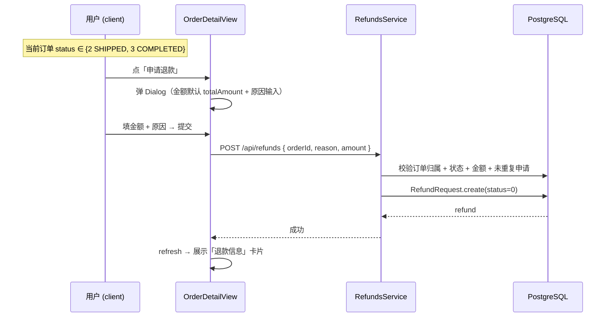
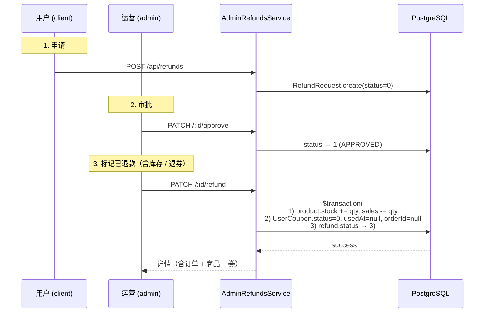
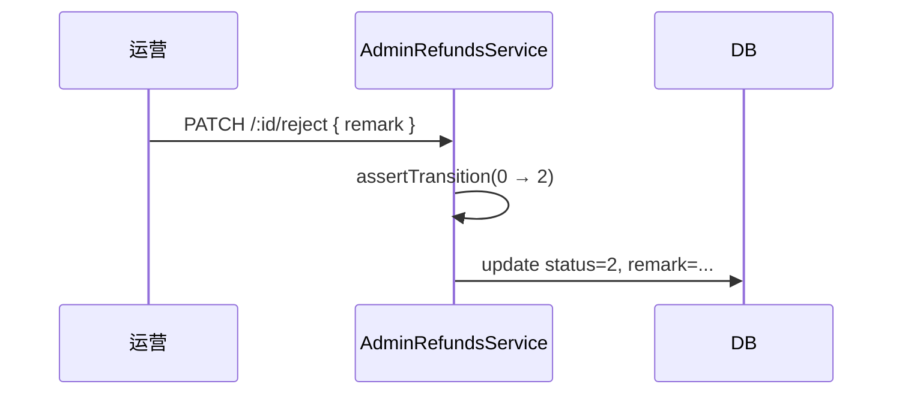

# 11 退款与售后

> Phase 2 / 2.4 模块。沿用 Phase 1 已建的 `RefundRequest` 表，新增客户端申请 + 后台审批 + 退券联动。

## 1. 模块定位

用户对「已发货 / 已完成」订单发起退款申请，运营在后台审批。审批通过后再标记「已退款」，系统自动退还商品库存、退回关联优惠券（来自 2.1）。

涉及三个角色：

- **用户（client）**：在已完成 / 已发货订单详情发起申请，跟踪退款状态
- **运营（admin）**：在 `/refunds` 列表审批（批准 / 拒绝 / 标记已退款）
- **系统**：`mark_refunded` 时事务内回滚库存 + 退券

## 2. 涉及数据表

| 表 | 用途 |
| --- | --- |
| `refund_requests` | 退款申请主体（沿用 Phase 1，已有 `status` 字段） |
| `orders` | 加 `refund: RefundRequest?` 反向关联，admin-orders 的 `findOne` 自动 include |
| `user_coupons` | mark_refunded 时通过 `order.coupons` 找到并退券 |
| `products` | mark_refunded 时还原 stock / 减 sales |

`refund_requests.status` 枚举：

| code | 含义 |
| --- | --- |
| `0` PENDING | 待审 |
| `1` APPROVED | 已批准（待标记已退款） |
| `2` REJECTED | 已拒绝（终态） |
| `3` REFUNDED | 已退款（终态） |

## 3. Server 接口清单

### 3.1 客户端接口（`server/src/refunds/`）

| 方法 | 路径 | 说明 |
| --- | --- | --- |
| `POST` | `/api/refunds` | 创建退款申请（body: `orderId, reason, amount`，需登录） |
| `GET` | `/api/refunds/my?status=0\|1\|2\|3` | 我的退款记录（分页 + 状态筛选） |
| `GET` | `/api/refunds/:id` | 详情（自动校验归属） |

> 整控制器 `@UseGuards(JwtAuthGuard)`。

#### 创建退款（`RefundsService.create`）校验

1. 订单存在 + 属于当前用户
2. 订单状态 ∈ {2 SHIPPED, 3 COMPLETED}（0/1 应走取消，4 已取消）
3. `amount > 0` 且 `amount ≤ order.totalAmount`
4. 该订单未存在退款申请（`refund_requests.order_id @unique`）

### 3.2 后台接口（`server/src/admin-refunds/`）

| 方法 | 路径 | 权限码 | 说明 |
| --- | --- | --- | --- |
| `GET` | `/api/admin/refunds` | `refund:list` | 列表（status / keyword 筛选 + 分页） |
| `GET` | `/api/admin/refunds/:id` | `refund:detail` | 详情（含订单、用户、商品、优惠券） |
| `PATCH` | `/api/admin/refunds/:id/approve` | `refund:approve` | 批准（PENDING → APPROVED） |
| `PATCH` | `/api/admin/refunds/:id/reject` | `refund:reject` | 拒绝（PENDING → REJECTED，必填 `remark`） |
| `PATCH` | `/api/admin/refunds/:id/refund` | `refund:refund` | 标记已退款（APPROVED → REFUNDED） |

#### 状态机（与订单状态机同样的风格）

```ts
export const REFUND_TRANSITIONS: Record<RefundStatus, RefundStatus[]> = {
  0: [1, 2],   // PENDING  → APPROVED / REJECTED
  1: [3],      // APPROVED → REFUNDED
  2: [],       // REJECTED (终态)
  3: []        // REFUNDED (终态)
}
```

跨级跳一律 400。

#### 标记已退款（`AdminRefundsService.markRefunded`）事务

1. 遍历订单 items，每个商品 `stock += quantity, sales -= quantity`
2. 遍历订单关联的 `UserCoupon`，`status=0, usedAt=null, orderId=null`
3. `refund.status → 3`

不退券的退款 = 不存在的场景（演示版不实现部分退券 / 退部分金额时退对应金额的券）。

### 3.3 订单端连带改动

`server/src/client-orders/client-orders.service.ts` 的 `findOne` / `cancel` / `confirmReceipt` 在 include 中加 `refund: true`，便于前端 OrderDetailView 一次性显示订单和退款状态。

`server/src/admin-orders/admin-orders.service.ts` 的 `findOne` 同样 include `refund: true`，便于 OrderListView 详情 Drawer 显示退款卡片。

## 4. Admin 路由与页面

| 路由 | 文件 | 说明 |
| --- | --- | --- |
| `/refunds` | `admin/src/views/RefundListView.vue` | 主列表（状态 tab + 关键字搜索 + 分页） |
| `/refunds/:id` | `admin/src/views/RefundDetailView.vue` | 详情 + 审批（批准 / 拒绝 / 标记已退款） |
| `/orders` | `admin/src/views/OrderListView.vue`（Drawer 改动） | 详情 Drawer 底部新增「退款信息」卡片，状态 tag + 跳转链接 |

API 文件：`admin/src/api/admin-refunds.ts`，与 `admin-coupons.ts` 同风格。

### 列表字段

| 列 | 字段 |
| --- | --- |
| ID | `id` |
| 订单号 | `order.orderNo` |
| 用户 | `order.user.nickname / username` |
| 退款金额 | `amount`（红色） |
| 原因 | `reason`（超长省略） |
| 状态 | `status`（warning / primary / default / success 四种 tag） |
| 申请时间 | `createdAt` |

筛选：状态 tab（全部 / 待审 / 已批准 / 已拒绝 / 已退款）+ 关键字（RefundRequest.id / RefundRequest.orderId / 用户名）

### 详情页

- 退款基本信息（id / 订单号 / 金额 / 状态 tag / 原因 / 备注 / 申请时间）
- 订单信息（订单号 / 状态 / 总额 / 使用优惠券）
- 商品列表（与 OrderDetail 共用模板）
- 按钮区：
  - 状态 0：批准 / 拒绝（拒绝弹 dialog 填原因）
  - 状态 1：标记已退款（确认后不可撤销）
  - 状态 2/3：仅显示状态 tag，无操作

## 5. 客户端路由与页面

| 路由 | 文件 | 说明 |
| --- | --- | --- |
| `/refunds/my` | `client/src/views/RefundListView.vue` | 我的退款（状态 tab + 下拉加载） |
| `/refunds/detail?id=X` | `client/src/views/RefundDetailView.vue` | 退款详情 |
| `/order/detail?id=X` | `client/src/views/OrderDetailView.vue`（改动） | 已发货 / 已完成订单显示「申请退款」按钮 + 退款信息卡片 |

### 申请退款流程



## 6. 关键流程

### 6.1 完整退款链（含退券联动）



### 6.2 拒绝



## 7. 权限点

| 权限码 | 用途 | ADMIN 默认 |
| --- | --- | --- |
| `refund:list` | 列表 / 详情 / 路由 meta | ✓ |
| `refund:detail` | 详情接口 + 路由 meta | ✓ |
| `refund:approve` | 批准按钮 + 接口 | ✓ |
| `refund:reject` | 拒绝按钮 + 接口 | ✓ |
| `refund:refund` | 标记已退款按钮 + 接口 | ✓ |

`SUPER_ADMIN` 通配 `*` 自动放行。

## 8. 演示版简化

- 不接真实支付网关：审批通过后 admin 手动点「标记已退款」即视为完成
- 不支持部分退券：若 `amount < order.totalAmount`，仍退整张券（演示版简化）
- 不开放 admin 代客申请：退款申请只能由订单所属用户发起

## 9. 关联

- 2.1 优惠券模块的「退券」钩子由本模块 mark_refunded 时调用
- 2.2 库存预警：本模块 mark_refunded 时会增加库存（被 2.2 的 InventoryLog 捕获）

## 10. 相关文档

- 服务端模块清单：`10-服务端/02-模块总览.md`
- 数据表结构：`10-服务端/03-数据库Schema说明.md`
- 优惠券文档（退券源头）：`20-管理后台/08-优惠券与促销.md`
- 订单文档：`20-管理后台/06-订单管理.md`
