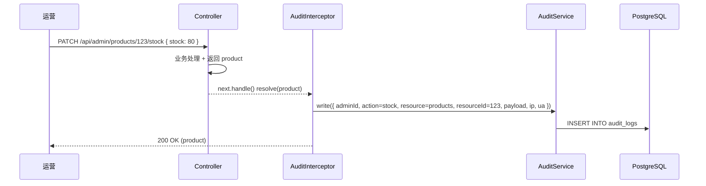
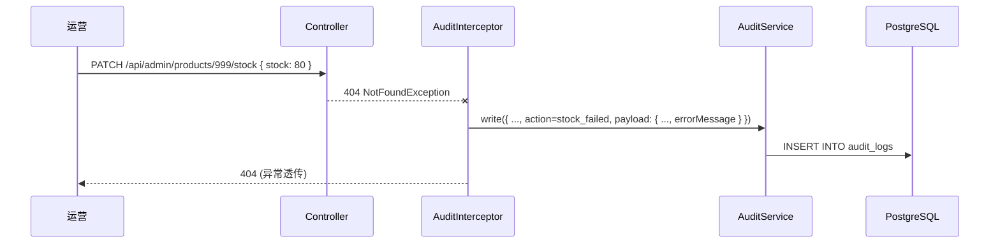

# 13 操作日志

> Phase 2 / 2.6 模块。新增 `AuditLog` 表 + 全局 NestJS 拦截器，自动捕获后台所有写操作（POST/PATCH/PUT/DELETE）写日志，含失败请求。

## 1. 模块定位

后台所有写操作通过全局拦截器自动落库，方便运营追溯谁、何时、改了什么。失败请求也写一条日志（action 后缀 `_failed`），便于审计越权尝试和业务异常。

涉及 2 个角色：

- **运营（admin）**：在 `/audit-logs` 列表筛选 / 查看 / 展开 payload
- **系统**：拦截器在 controller 返回响应后旁路写日志

## 2. 涉及数据表

### 新表：`audit_logs`

| 字段 | 类型 | 说明 |
| --- | --- | --- |
| `id` | `Int` PK | 自增 |
| `admin_id` | `Int?` FK → `admin_users.id` | 操作人；客户端 / 系统行为写 null |
| `action` | `String` | create / update / delete / approve / block / ship / grant / ... |
| `resource` | `String` | 资源类型（products / orders / refunds / reviews / ...） |
| `resource_id` | `Int?` | 目标实体 ID；无明确 ID 时（如 list 类操作）写 null |
| `payload` | `Json?` | 请求 body；敏感字段已被替换为 `***` |
| `ip` | `String?` | 客户端 IP（兼容 `X-Forwarded-For`） |
| `user_agent` | `String?` | 浏览器 UA |
| `created_at` | `DateTime` | 标准审计 |

索引：

- `@@index([adminId, createdAt])` —— 单人操作历史
- `@@index([resource, createdAt])` —— 按资源类型 + 时间范围审计

`AdminUser` 加 `auditLogs AuditLog[]` 反向关联。

## 3. Server 设计

### 3.1 全局拦截器（`server/src/audit/audit.interceptor.ts`）

通过 `APP_INTERCEPTOR` 全局注册，覆盖所有 `/api/admin/*` 接口（client 端接口走 JWT Guard 自动跳过，因为路径不匹配）。

```ts
intercept(ctx, next) {
  const req = ctx.switchToHttp().getRequest()
  if (!WRITE_METHODS.has(req.method)) return next.handle()
  const meta = parseUrl(req.url, req.method)
  const payload = req.body ? sanitize(req.body) : null
  return next.handle().pipe(
    tap({
      next: (data) => this.audit.write({ ...meta, payload, status: "ok" }),
      error: (err) => this.audit.write({ ...meta, payload, status: "failed", errorMessage: err.message })
    })
  )
}
```

关键决策：**旁路写、不 await**。日志写失败不阻塞主流程；不放在 `$transaction` 内（避免日志错误回滚业务）。

### 3.2 资源解析（`parseUrl`）

去掉 `/api/admin` 前缀后按 `/` 切段：

| URL | resource | resourceId | action |
| --- | --- | --- | --- |
| `products/123/stock` | products | 123 | stock |
| `products/123/status` | products | 123 | status |
| `coupons/45/grant` | coupons | 45 | grant |
| `refunds/12/approve` | refunds | 12 | approve |
| `inventory/products/123/threshold` | inventory | 123 | threshold |
| `auth/login` | auth | null | login |

规则：第一段 = resource；首个数字段 = resourceId；末尾非数字段（且非首段）= action 后缀。

响应 `data.id` 存在时优先用（创建场景更准），否则用 URL 解析的资源 ID。

### 3.3 敏感字段过滤（`sanitize`）

`payload` 写入前过滤黑名单 key，将其值替换为 `***`：

```
password / passwordHash / newPassword / oldPassword /
token / accessToken / refreshToken
```

递归处理嵌套对象 / 数组。

### 3.4 后台查询接口（`server/src/admin-audit-logs/`）

| 方法 | 路径 | 权限码 | 说明 |
| --- | --- | --- | --- |
| `GET` | `/api/admin/audit-logs?adminId&resource&action&dateFrom&dateTo&page&pageSize` | `audit:view` | 列表（操作人 / 资源 / 动作 / 日期范围 + 分页） |

## 4. Admin 路由与页面

| 路由 | 文件 | 说明 |
| --- | --- | --- |
| `/audit-logs` | `admin/src/views/AuditLogListView.vue` | 主列表 + 详情 Dialog |

API 文件：`admin/src/api/admin-audit-logs.ts`。

### 列表字段

| 列 | 字段 |
| --- | --- |
| ID | `id` |
| 时间 | `createdAt` |
| 操作人 | `admin.nickname ?? admin.username` + `#adminId`，admin 为空时显示「系统」 |
| 资源 | `resource` |
| 动作 | `action`（带 tag，按类型染色：success/primary/info/warning/danger） |
| 目标 ID | `resourceId`（不存在时 `-`） |
| IP | `ip` |
| 操作 | 「详情」 按钮 → Dialog |

筛选：操作人 ID / 资源（含糊）/ 动作（含糊）/ 日期范围（dateFrom~dateTo），分页 20/50/100。

### 详情 Dialog

展示完整字段：日志 ID / 时间 / 操作人 / IP / 资源 / 动作 tag / 目标 ID / UA（等宽字体）/ Payload（JSON 格式化展示，最多 280px 滚动）。

## 5. 关键流程

### 5.1 成功操作



### 5.2 失败操作



## 6. 权限点

| 权限码 | 用途 | ADMIN 默认 |
| --- | --- | --- |
| `audit:view` | 查看操作日志页 + 接口 | ✓ |

`types.ts` 中占位的 `audit:view` 直接用上（无需展开通配，因为没有细分权限）。

## 7. 演示版简化

- **不分批**：当前 `findMany` 不带 `skip/take`，demo 数据 < 1000 行无压力
- **不清理历史**：演示版不写定时清理任务，生产环境应按 `createdAt` 归档或清理
- **payload 全量存**：不存 diff，只存原始请求 body；后续可优化为「before / after」对照
- **GET 类不写**：拦截器白名单 POST/PATCH/PUT/DELETE

## 8. 关联

- 所有 `/api/admin/*` 写操作自动覆盖，无需手动埋点
- 与 2.5 数据导出互不干扰（导出是 GET，不写日志）
- 与 2.7 系统设置：若后续加 `Setting` KV 存「审计保留天数」可自动清理旧日志

## 9. 相关文档

- 服务端模块清单：`10-服务端/02-模块总览.md`
- 数据表结构：`10-服务端/03-数据库Schema说明.md`
- 权限码完整列表：`10-服务端/04-认证与权限体系.md` 第 5 节
- 数据导出（GET 不写日志对比）：`20-管理后台/12-数据导出.md`

