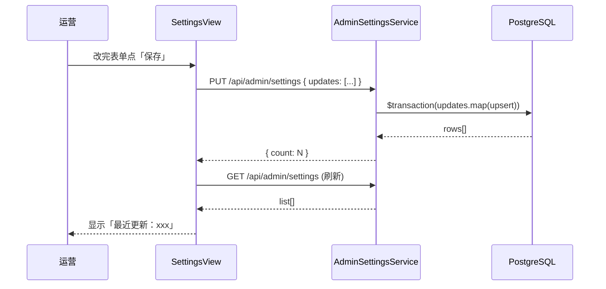
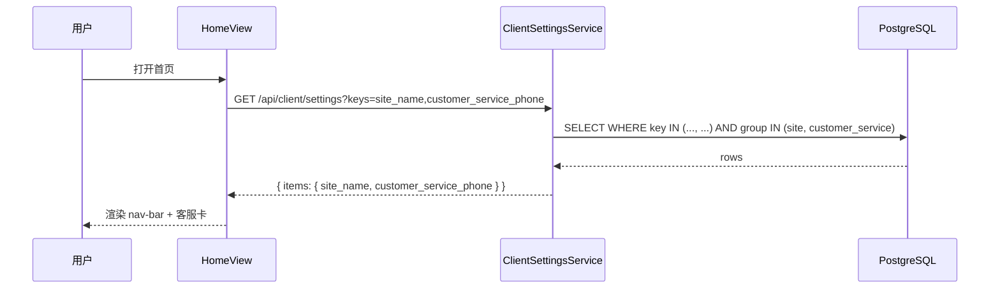

# 14 系统设置

> Phase 2 / 2.7 模块。KV 配置存储，按 group 分组（站点 / 客服 / 支付 / 运费），后台批量编辑，客户端按 key 公共读。

## 1. 模块定位

运营在后台 `/settings` 编辑站点信息、客服联系方式、支付配置、运费规则；客户端首页 / 商品详情按需按 key 取值。

涉及 2 个角色：

- **运营（admin）**：在 `/settings` 编辑 4 组配置，批量保存
- **客户端（client）**：通过 `GET /api/client/settings?keys=...` 公共读白名单 key

## 2. 涉及数据表

### 新表：`settings`

| 字段 | 类型 | 说明 |
| --- | --- | --- |
| `id` | `Int` PK | 自增 |
| `key` | `String` @unique | 配置键，如 `site_name` |
| `value` | `Json` | 任意 JSON（字符串 / 数字 / 布尔 / 对象 / 数组） |
| `group` | `String` @default(`"general"`) | 分组：`site` / `customer_service` / `payment` / `shipping` |
| `description` | `String?` | 后台表单下的辅助说明 |
| `created_at` / `updated_at` | `DateTime` | 标准审计 |

索引：`@@index([group])` —— 后台按组渲染时使用。

> roadmap 只列了 key / value / description，本轮加 `group` 列方便前端按组渲染。如不需要后续可移除。

## 3. Server 接口清单

### 3.1 后台接口（`server/src/admin-settings/`）

| 方法 | 路径 | 权限码 | 说明 |
| --- | --- | --- | --- |
| `GET` | `/api/admin/settings` | `setting:list` | 列出所有设置（按 group / key 排序） |
| `PUT` | `/api/admin/settings` | `setting:list` | 批量 upsert：body `{ updates: [{ key, value }] }` |

批量 upsert 行为：

- 已存在的 key → update `value` + `updatedAt`
- 不存在的 key → create，group 默认为 `"general"`（管理员不会通过本接口创建新 key，新 key 必须由代码 / seed 写入）
- 整体在同一 `$transaction` 内

### 3.2 客户端公共接口（`server/src/client-settings/`）

| 方法 | 路径 | 权限 | 说明 |
| --- | --- | --- | --- |
| `GET` | `/api/client/settings` | `@Public`（无需登录） | 公共读，不传 `keys` 返回 site + customer_service 全部；传 `keys=site_name,customer_service_phone` 只返回指定 key |

**白名单**：只允许 `site_*` / `customer_service_*` 前缀的 key 通过本接口访问，其他前缀（`payment_*` / `shipping_*`）即使指定也静默忽略。

`keys` 参数支持逗号分隔字符串或数组（由 controller 归一化）。

### 3.3 DTO

```ts
class SettingUpdateItem {
  key: string          // ≤ 64 字符
  value: unknown       // class-validator @IsObject 限制对象（演示版简化）
}
class UpdateSettingsDto {
  updates: SettingUpdateItem[]  // 至少 1 项
}
```

> 注意 `@IsObject` 限制 value 必须是对象（包括数组也算 object），纯字符串 / 数字需要后端放开；演示版先这样写。

## 4. 设置分组 + demo 数据

seed 写 12 条，覆盖 4 个 group：

| group | key | value |
| --- | --- | --- |
| site | `site_name` | `"我的小店"` |
| site | `site_logo` | picsum URL |
| site | `site_description` | `"一家专注于生活好物的精选商城"` |
| site | `icp` | `""` |
| customer_service | `customer_service_phone` | `"400-123-4567"` |
| customer_service | `customer_service_wechat` | `"my_shop_cs"` |
| customer_service | `working_hours` | `"9:00-21:00"` |
| payment | `payment_methods` | `["wechat", "alipay"]` |
| payment | `min_order_amount` | `0` |
| shipping | `free_shipping_threshold` | `99` |
| shipping | `default_shipping_fee` | `10` |
| shipping | `supported_regions` | `["中国大陆"]` |

## 5. Admin 路由与页面

| 路由 | 文件 | 说明 |
| --- | --- | --- |
| `/settings` | `admin/src/views/SettingsView.vue` | 4 个 tab（站点 / 客服 / 支付 / 运费），每 tab 一组表单 + 保存按钮 |

API 文件：`admin/src/api/admin-settings.ts`。

### 表单控件映射

- 字符串 → `el-input`
- 多行文本 → `el-input type="textarea"`
- 数字 → `el-input-number`
- 多选支付方式 → `el-checkbox-group`
- 支持地区（一行一个）→ `el-input type="textarea"` + 保存时按 `\n` split 成数组

每个 tab 的「保存」按钮调用批量 PUT，写入当前组下所有 key。保存成功自动重新拉一次，更新页面顶部「最近更新：xxx」时间戳。

## 6. 客户端集成

按 roadmap 「可选」，本轮做最小集成：

- `client/src/api/settings.ts` —— 公共读封装
- `client/src/views/HomeView.vue` —— nav-bar 标题改用 `site_name`；底部加客服电话卡

```ts
const r = await listPublicSettings(['site_name', 'customer_service_phone'])
const items = r.items  // { site_name: string, customer_service_phone: string }
```

后续可在 `client/src/views/ProductDetailView.vue` / `CheckoutView.vue` / `CartView.vue` 等按需接入 `min_order_amount` / `free_shipping_threshold` 等 key。

## 7. 关键流程

### 7.1 后台批量保存



### 7.2 客户端首页加载



## 8. 权限点（修订）

> 与代码同步后的事实：路由 meta 用 `setting:list`（修复自 `setting:edit`，原 `setting:edit` 不存在于 `AdminPermission` 类型与 seed 中）。具体分组权限在 PUT 接口层校验：

| 权限码 | 用途 | ADMIN 默认 |
| --- | --- | --- |
| `setting:list` | 后台查看设置（路由 meta + 菜单 + GET 接口） | ✓ |
| `setting:site:edit` | 编辑 site group（站点名 / Logo / 描述 / ICP） | ✓ |
| `setting:customer_service:edit` | 编辑 customer_service group（电话 / 微信 / 工作时间） | ✓ |
| `setting:payment:edit` | 编辑 payment group（支付方式 / 起送金额） | ✗（仅 SUPER_ADMIN） |
| `setting:shipping:edit` | 编辑 shipping group（运费门槛 / 默认运费 / 地区） | ✗（仅 SUPER_ADMIN） |
| `setting:general:edit` | 编辑 general group | ✗（仅 SUPER_ADMIN） |

`settings` 表 `value` 字段：`@IsObject` 限制必须是对象（含数组），纯字符串 / 数字需后端放开（演示版先用 `{}` 包裹）。

原 §8 简表保留如下，标注"`setting:list` 等价"。

---

## 8. 权限点

| 权限码 | 用途 | ADMIN 默认 |
| --- | --- | --- |
| `setting:list` | 后台查看 / 编辑全部设置 | ✓ |

客户端公共读无需权限（`@Public`）。

`types.ts` 中占位的 `setting:list` 直接用上。

## 9. 演示版简化

- **新 key 只能由 seed / 代码创建**：批量 upsert 在 key 不存在时创建但 group 默认为 `general`，管理员无法在线新增带正确 group 的 key
- **value 必须是对象**：`@IsObject` 限制使纯字符串 / 数字无法存（演示版先用对象 wrapper 临时存储；后续可加 `@IsDefined` 替换）
- **不分版本**：每次 upsert 直接覆盖 value，不存历史
- **不做缓存**：客户端每次进首页都重新请求（演示版无 Redis / CDN）

## 10. 关联

- 与 2.6 操作日志联动：所有 PUT `/api/admin/settings` 会被 AuditInterceptor 自动记录
- 与 2.7+ 客户端接入预留：后续可在 CheckoutView 用 `min_order_amount` 校验 / CartView 用 `free_shipping_threshold` 计算运费

## 11. 相关文档

- 服务端模块清单：`10-服务端/02-模块总览.md`
- 数据表结构：`10-服务端/03-数据库Schema说明.md`
- 操作日志（自动捕获设置修改）：`20-管理后台/13-操作日志.md`

