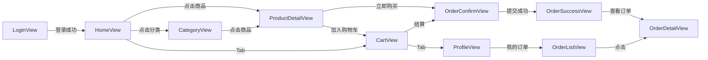

# 02 移动端路由与页面结构

> 移动端所有页面（10 个）的清单、路由、布局归属、关键文件。

## 1. 路由总览

文件：`client/src/router/index.ts`

| 路由 | 页面组件 | 父布局 | 是否需登录 | 备注 |
| --- | --- | --- | --- | --- |
| `/login` | `LoginView.vue` | — | 否 | 登录入口 |
| `/home` | `HomeView.vue` | `TabBarLayout` | 是 | Tab：首页 |
| `/category` | `CategoryView.vue` | `TabBarLayout` | 是 | Tab：分类 |
| `/cart` | `CartView.vue` | `TabBarLayout` | 是 | Tab：购物车 |
| `/profile` | `ProfileView.vue` | `TabBarLayout` | 是 | Tab：我的 |
| `/product/:id` | `ProductDetailView.vue` | — | 是 | 商品详情（动态 ID） |
| `/order/confirm` | `OrderConfirmView.vue` | — | 是 | 确认订单（支持 `?productId&quantity` 直购） |
| `/order/success` | `OrderSuccessView.vue` | — | 是 | 下单成功（带 `?id`） |
| `/order/list` | `OrderListView.vue` | — | 是 | 我的订单 |
| `/order/detail` | `OrderDetailView.vue` | — | 是 | 订单详情（带 `?id`） |
| `/coupons` | `CouponCenterView.vue` | — | 是 | 领券中心 + 我的优惠券（2 个 Tab） |
| `/refunds/my` | `RefundListView.vue` | — | 是 | 我的退款（状态 Tab + 列表） |
| `/refunds/detail` | `RefundDetailView.vue` | — | 是 | 退款详情（带 `?id`） |

未匹配 → 重定向 `/home`。

## 2. TabBar 布局

文件：`client/src/layouts/TabBarLayout.vue`

```
┌─────────────────────────────┐
│                             │
│       <router-view>         │  ← 子页面（HomeView / CategoryView / CartView / ProfileView）
│                             │
├─────────────────────────────┤
│ 🏠首页  ▢分类  🛒购物车  👤我的 │  ← van-tabbar
└─────────────────────────────┘
```

要点：

- 4 个 Tab：首页 / 分类 / 购物车 / 我的
- 激活态绑定 `route.name`
- 切换 Tab 触发 `router.push({ name })`

## 3. 各页面要点

### LoginView.vue

- 表单：用户名 + 密码
- 提交：`userStore.login(form)` → 成功后 `router.replace(redirect ?? '/home')`
- 底部文案「演示版：任意非空用户名 / 密码均可登录」**已过时**——实际走 `/api/auth/login`，仅 seed 写入的 5 个测试账号（`alice~eve / user123`）能成功

### HomeView.vue

- 顶部：`van-nav-bar fixed title="我的商城"`
- 轮播：`van-swipe autoplay=4000` 调 `listBanners()`
- 分类宫格：`van-grid :column-num="3"` 调 `listCategories()`
- 商品瀑布流：`van-pull-refresh + van-list` 调 `listProducts({ page, pageSize: 10 })`
- 点击商品 → `router.push(\`/product/${p.id}\`)`

### CategoryView.vue

- 左右两栏：`van-sidebar`（左 100px 分类）+ `van-list`（右商品）
- 切换分类：`watch(activeId, loadProducts)` 重置分页
- 点击商品 → `/product/:id`

### CartView.vue

- 全选：`van-checkbox v-model="allChecked"` 双向绑定到 store
- 商品行：封面 + 标题 + 库存/已售 + 数量 stepper（`van-stepper`） + 单个 checkbox + 删除按钮
- 结算：`van-submit-bar` 显示总金额 + 「结算」按钮
- 「结算」→ `router.push('/order/confirm')`
- 删除：「删除」按钮 → `cart.remove(productId)` + 刷新
- 空购物车：`van-empty`

### ProfileView.vue

- 用户卡片：头像 + 昵称 + 账号 + 手机号
- 菜单列表：「我的订单」「我的退款」「优惠券」「收货地址（Phase 2 待开发）」「客户服务」
- 退出登录：`showConfirmDialog` → `userStore.logout()` → `router.replace('/login')`

### ProductDetailView.vue

- 顶部：`van-nav-bar` 返回按钮
- 封面：`van-image`（可加 :src-set 多图）
- 价格：现价（红色）+ 原价（划线）
- 销量 / 库存：`已售 X · 库存 Y`
- 描述：`van-cell title="商品介绍"`
- 底部操作：「加入购物车」「立即购买」

### OrderConfirmView.vue

- 商品行：封面 + 标题 + 单价 + 数量
- 收货人表单：`van-cell-group` + `van-field`（姓名 / 手机 / 地址）
- 备注：`van-field type="textarea"`
- 总金额 + 「提交订单」
- 两种入口：
  - 从购物车来 → 取 `cart.selectedLines()` → 每个商品调 `getProduct(id)` 拿最新价格
  - 「立即购买」直购 → 读 `route.query.productId` / `quantity`，只加载 1 个商品
- 提交：`createOrder({ items, receiver, remark })` → 跳 `/order/success?id=...`
- 购物车来时：清掉已结算的 `cart.clearSelected()`

### OrderSuccessView.vue

- 显示订单 ID（从 `route.query.id`）
- 操作：「查看订单」（→ `/order/detail?id=...`）/「继续购物」（→ `/home`）

### OrderListView.vue

- 状态分段（Tab）：全部 / 待付款 / 待发货 / 已发货 / 已完成 / 已取消
- 列表：`van-card` 行展示订单摘要（订单号 / 商品数 / 金额 / 状态）
- 点击 → `/order/detail?id=...`
- 支持下拉刷新 + 上拉加载更多

### OrderDetailView.vue

- 状态 + 进度条（按状态变色）
- 收货人
- 商品列表
- 订单信息（订单号 / 创建时间 / 支付时间 / 物流单号等）
- 操作：
  - 待付款（status=0）→「取消订单」
  - 待发货（status=1）→「提醒发货（toast 占位）」
  - 已发货（status=2）→「确认收货」→ 调 `confirmReceipt`

## 4. 全局前置守卫

```ts
router.beforeEach((to) => {
  const userStore = useUserStore()
  const requiresAuth = to.meta.requiresAuth === true

  if (requiresAuth && !userStore.isLoggedIn) {
    return { name: 'login', query: { redirect: to.fullPath } }
  }
  if (to.name === 'login' && userStore.isLoggedIn) {
    return { name: 'home' }
  }

  if (typeof to.meta.title === 'string') {
    document.title = `${to.meta.title} · 我的商城`
  }
})
```

> 注意：移动端的 `requiresAuth` 默认值是 `true`（与后台相反）。所有 Tab 页面 + 订单相关页面都需要登录。

## 5. 页面间跳转关系



## 6. 路由 meta 与 query 参数约定

| 路由 | query 参数 | 用途 |
| --- | --- | --- |
| `/order/confirm` | `productId?`、`quantity?` | 「立即购买」直购 |
| `/order/success` | `id` | 显示订单 ID |
| `/order/detail` | `id` | 订单 ID |
| `/product/:id` | （路径参数） | 商品 ID |

## 7. 相关文档

- 技术栈 / 启动：`01-技术栈与启动.md`
- 状态管理：`03-状态管理与接口调用.md`
- 各页面业务说明：`05-业务模块说明.md`
