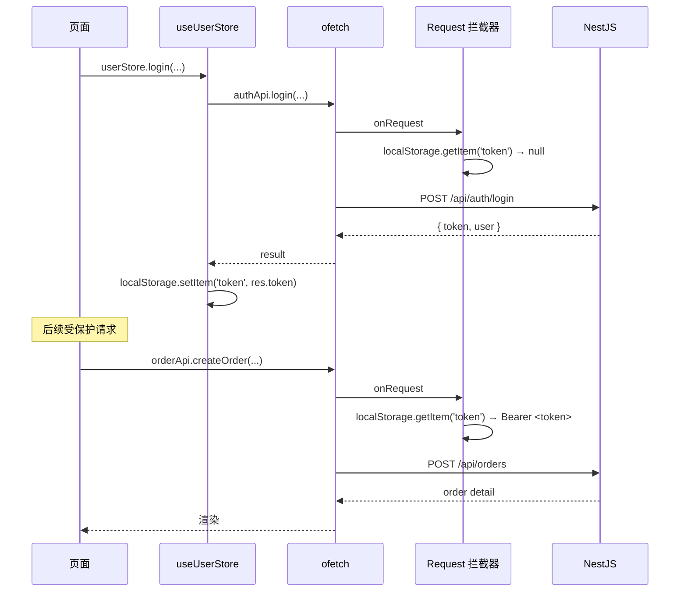

# 03 状态管理与接口调用

> 移动端 Pinia store（user / cart）+ ofetch HTTP 封装 + token 自动注入。

## 1. 状态管理概览

| Store | 文件 | 内容 | 持久化 |
| --- | --- | --- | --- |
| `useUserStore` | `client/src/stores/user.ts` | 当前用户、token | 手写 localStorage（key: `token` / `user`） |
| `useCartStore` | `client/src/stores/cart.ts` | 购物车 items | watch + 手写 localStorage（key: `cart`） |

> 与后台（admin）不同：移动端没有用 `pinia-plugin-persistedstate`，而是在 store 内手动维护 localStorage。

## 2. HTTP 封装

文件：`client/src/api/request.ts`

```ts
export const request = ofetch.create({
  baseURL: '/api',          // 注意：没有 /admin
  timeout: 10_000,
  onRequest({ options }) {
    const token = localStorage.getItem('token')
    if (token) {
      const headers = new Headers(options.headers as HeadersInit | undefined)
      headers.set('Authorization', `Bearer ${token}`)
      options.headers = headers
    }
  },
  onResponseError({ response }) {
    if (response.status === 401) {
      localStorage.removeItem('token')
      localStorage.removeItem('user')
    }
  }
})

export const delay = (ms = 300) => new Promise((r) => setTimeout(r, ms))
```

要点：

- **`baseURL = '/api'`** — 全部接口走 `/api/*`，**不带** `/admin`
- `Authorization: Bearer <token>` — 自动从 localStorage 读 `token`
- 401 自动清掉本地，但**不自动跳登录**（路由守卫会接管）
- `delay` 工具函数：模拟网络延迟

## 3. useUserStore

文件：`client/src/stores/user.ts`

```ts
export const useUserStore = defineStore('user', () => {
  const token = ref<string>(localStorage.getItem('token') || '')
  const user = ref<User | null>(readUser())

  const isLoggedIn = computed(() => !!token.value)

  async function login(payload: authApi.LoginPayload) {
    const res = await authApi.login(payload)
    token.value = res.token
    user.value = res.user
    localStorage.setItem('token', res.token)
    localStorage.setItem('user', JSON.stringify(res.user))
    return res
  }

  async function logout() {
    await authApi.logout()
    token.value = ''
    user.value = null
    localStorage.removeItem('token')
    localStorage.removeItem('user')
  }

  return { token, user, isLoggedIn, login, logout }
})

function readUser(): User | null {
  const cached = localStorage.getItem('user')
  if (!cached) return null
  try { return JSON.parse(cached) as User } catch { return null }
}
```

要点：

- 初始化时从 `localStorage` 读，兼容刷新页面
- `login` / `logout` 同步写 localStorage
- 失败时（密码错误 / 用户不存在）：后端抛 `UnauthorizedException('用户名或密码错误')`，`ofetch` 抛错 → store 不更新 → UI 弹错误 toast

## 4. useCartStore

文件：`client/src/stores/cart.ts`

设计原则：

- 购物车**只在客户端持久化**（localStorage），**不下发到 server**
- item 只保存最小信息：`{ productId, quantity, selected }`
- 显示时由调用方按需 fetch `/products/:id` 取最新价格 / 库存

```ts
export interface CartLine {
  productId: number
  quantity: number
  selected: boolean
}

const STORAGE_KEY = 'cart'

function loadFromStorage(): CartLine[] {
  try {
    const raw = localStorage.getItem(STORAGE_KEY)
    if (!raw) return []
    const parsed = JSON.parse(raw)
    if (!Array.isArray(parsed)) return []
    return parsed.filter((x): x is CartLine =>
      typeof x === 'object' && x !== null &&
      typeof x.productId === 'number' &&
      typeof x.quantity === 'number' &&
      typeof x.selected === 'boolean'
    )
  } catch { return [] }
}

function saveToStorage(items: CartLine[]) {
  try { localStorage.setItem(STORAGE_KEY, JSON.stringify(items)) } catch { /* silent */ }
}

export const useCartStore = defineStore('cart', () => {
  const items = ref<CartLine[]>(loadFromStorage())

  watch(items, (v) => saveToStorage(v), { deep: true })

  const totalCount = computed(() => items.value.reduce((s, it) => s + it.quantity, 0))
  const selectedCount = computed(() =>
    items.value.filter((it) => it.selected).reduce((s, it) => s + it.quantity, 0)
  )
  const allSelected = computed({
    get: () => items.value.length > 0 && items.value.every((it) => it.selected),
    set: (val: boolean) => { items.value = items.value.map((it) => ({ ...it, selected: val })) }
  })

  function add(productId: number, quantity = 1) {
    const existing = items.value.find((it) => it.productId === productId)
    if (existing) existing.quantity += quantity
    else items.value.push({ productId, quantity, selected: true })
  }

  function setQuantity(productId: number, quantity: number) {
    const it = items.value.find((x) => x.productId === productId)
    if (it) it.quantity = Math.max(1, Math.min(99, quantity))  // 1..99 范围
  }

  function remove(productId: number) {
    items.value = items.value.filter((it) => it.productId !== productId)
  }

  function clearSelected() {
    items.value = items.value.filter((it) => !it.selected)
  }

  function clear() { items.value = [] }

  const selectedLines = () => items.value.filter((it) => it.selected)

  return { items, totalCount, selectedCount, allSelected, add, setQuantity, remove, clearSelected, clear, selectedLines }
})
```

要点：

- `watch(items, saveToStorage, { deep: true })` —— 任何字段变化都写 localStorage
- `add`：已存在则累加 `quantity`，不存在则推入并默认 `selected = true`
- `selectedLines`：结算时调用，返回勾选项
- `clearSelected`：下单成功后清掉已结算项

## 5. API 文件清单

| 文件 | 内容 |
| --- | --- |
| `client/src/api/request.ts` | ofetch 实例 + `delay` |
| `client/src/api/auth.ts` | `login`、`logout`、User / LoginResult 类型 |
| `client/src/api/banner.ts` | `listBanners`、Banner 类型 |
| `client/src/api/product.ts` | `listCategories`、`listProducts`、`getProduct`、分页响应类型 |
| `client/src/api/order.ts` | `createOrder`、`listMyOrders`、`getOrder`、`cancelOrder`、`confirmReceipt` |

### 关键类型（来自 `client/src/api/order.ts`）

```ts
export interface CartItemPayload { productId: number; quantity: number }
export interface ReceiverPayload { name: string; phone: string; address: string }
export interface CreateOrderPayload {
  items: CartItemPayload[]
  receiver: ReceiverPayload
  remark?: string
}

export interface OrderListItem {
  id: number
  orderNo: string
  userId: number
  totalAmount: number
  status: number
  itemCount: number
  receiver: unknown                       // 详情接口会反序列化为 OrderReceiver
  remark: string | null
  paidAt: string | null
  shippedAt: string | null
  completedAt: string | null
  cancelledAt: string | null
  shipCompany: string | null
  shipNo: string | null
  createdAt: string
  updatedAt: string
}

export interface OrderDetail extends Omit<OrderListItem, 'itemCount'> {
  items: OrderItem[]
  receiver: OrderReceiver
}
```

## 6. 当前接口调用情况

移动端**所有接口都已切到真实后端**（`client/src/api/*.ts` 均直接 `request<T>(...)` 调用）：

| 资源 | 真实接口 |
| --- | --- |
| 登录 / 登出 | `POST /api/auth/login`、`POST /api/auth/logout` |
| 轮播图 | `GET /api/banners` |
| 分类 / 商品 | `GET /api/categories`、`GET /api/products`、`GET /api/products/:id` |
| 订单 | `POST /api/orders`、`GET /api/orders/my`、`GET /api/orders/:id`、`PATCH /api/orders/:id/cancel`、`POST /api/orders/:id/confirm-receipt` |

> 历史说明：早期开发阶段 `request.ts` 注释称「所有接口走本地 mock」，那只是一段过时的代码注释。当前所有 api 文件都已切到真实调用，**mock 目录存在但为空**：`client/src/mock/` 目录保留但无文件，所有 api 已切到真实调用。`delay()` 是死代码，未来清理时可一起删除。
## 7. 鉴权链路



## 8. 相关文档

- 路由 / 页面：`02-路由与页面结构.md`
- 下单 / 支付流程图：`04-核心业务流程.md`
- 各页面业务说明：`05-业务模块说明.md`
- 后台 store（参考对比）：`20-管理后台/02-账号权限与登录.md`
