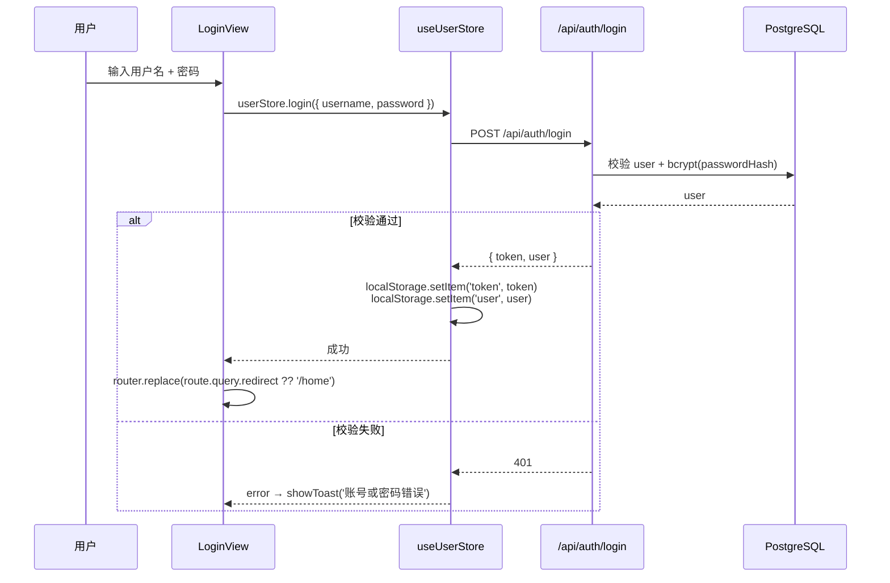
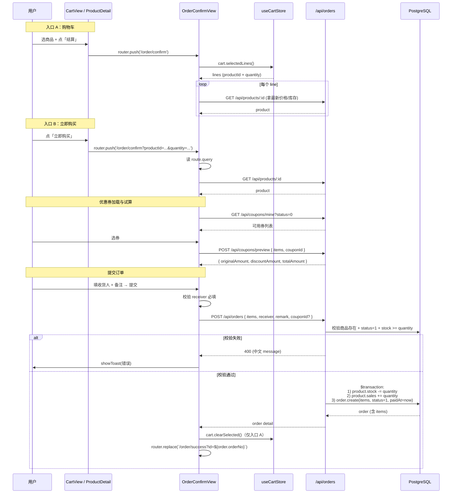
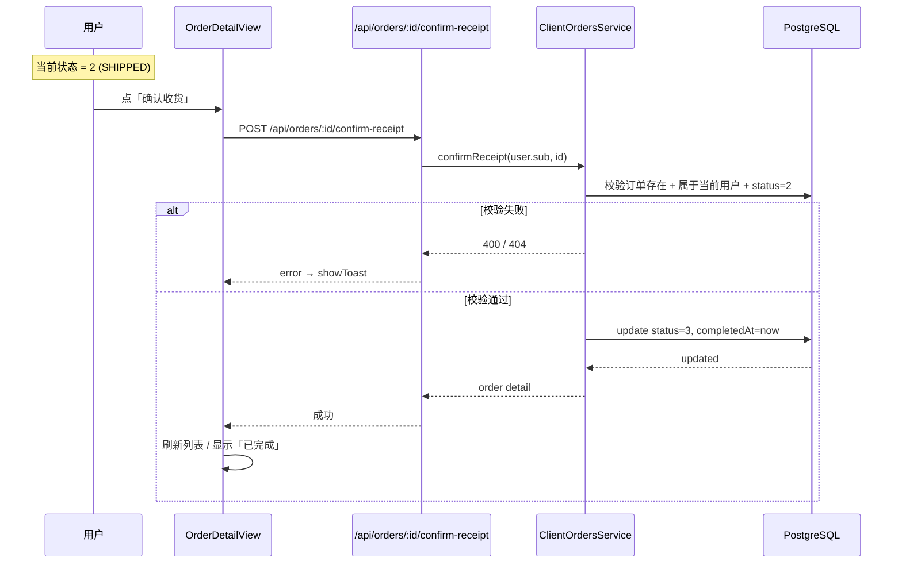
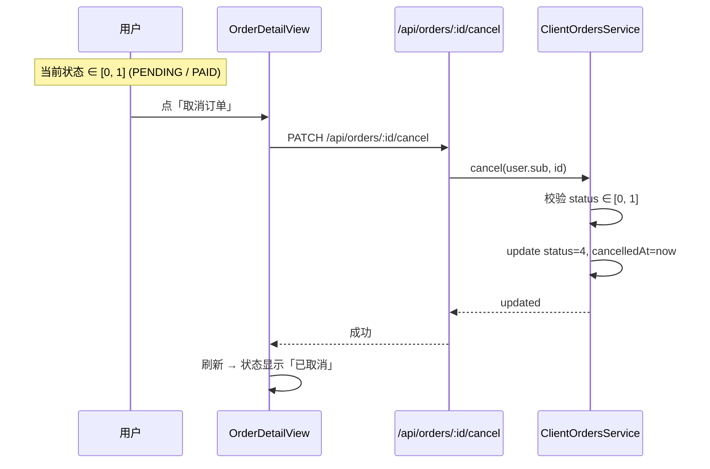
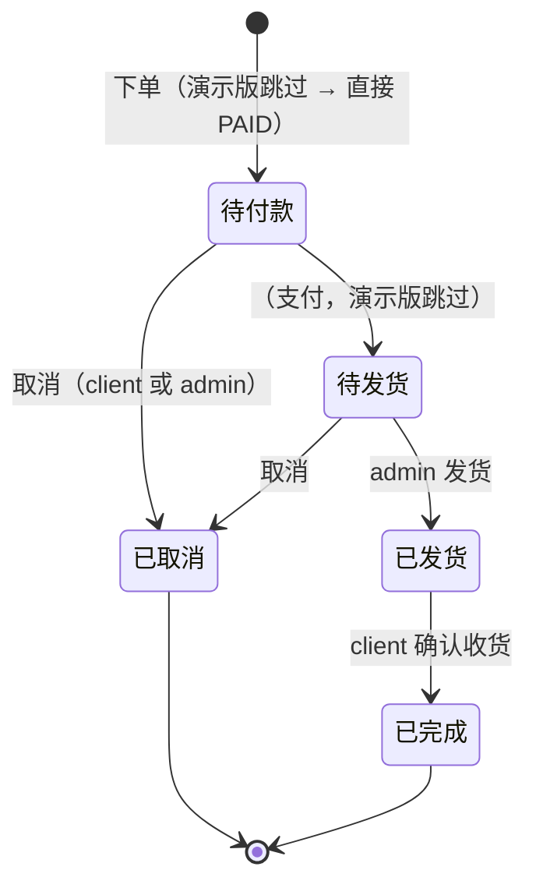

# 04 移动端核心业务流程

> 三个最关键的业务流程：登录、下单（结算）、确认收货。每个流程含时序图、关键校验点、相关表 / 接口。

## 1. 登录流程



要点：

- 实际走 NestJS `AuthService.login`：`bcrypt.compare(dto.password, user.passwordHash)`，密码错误抛 `UnauthorizedException('用户名或密码错误')`
- **真实版**：服务端走 `AuthService.login`，bcrypt 比对 `User.passwordHash`，签发 JWT（`JWT_SECRET`）
- 登录后路由：跳回 `route.query.redirect`（来自全局守卫带的），默认 `/home`

## 2. 下单（结算）流程

两个入口：

- **入口 A：购物车结算** — CartView → 「结算」→ OrderConfirmView（多商品）
- **入口 B：立即购买** — ProductDetailView → 「立即购买」→ OrderConfirmView（单商品，URL 带 `?productId&quantity`）



### 关键校验（`ClientOrdersService.create`）

```ts
const products = await this.prisma.product.findMany({ where: { id: { in: productIds } } })
if (products.length !== productIds.length) throw new BadRequestException('部分商品不存在')

for (const item of dto.items) {
  const p = products.find((x) => x.id === item.productId)!
  if (p.status !== 1) throw new BadRequestException(`商品「${p.title}」已下架`)
  if (p.stock < item.quantity) throw new BadRequestException(`商品「${p.title}」库存不足（剩 ${p.stock}）`)
}
```

### 事务要点

`ClientOrdersService.create` 在 `prisma.$transaction(async (tx) => {...})` 中：

1. 遍历 items，对每个商品 `product.update({ stock: { decrement }, sales: { increment } })`
2. 创建 `order`（`status: 1, paidAt: now`，模拟自动支付）
3. 嵌套创建 `order_items`（含 `productTitle` / `productCover` / `price` 快照）

任一步失败，整个事务回滚。

### 演示版简化

- **跳过真实支付**：直接 `status: 1, paidAt: now`
- 订单号生成：`generateOrderNo()` = `Date.now().toString(36).toUpperCase() + 4 位随机 base36`
- 收货人结构：`{ name, phone, address }`，每次下单必填（**无地址簿**）

## 3. 确认收货流程



要点：

- 仅 `SHIPPED (2)` 可确认收货；其他状态调用会抛 `BadRequestException`
- 服务端校验订单属于 `user.sub`（防越权）
- 完成时间 `completedAt = now`

## 4. 取消订单流程（客户端）



## 5. 状态机全貌



## 6. 订单快照设计

`order_items` 字段：`productTitle` / `productCover` / `price` 在下单时**直接写入**。

好处：

- 商家改商品标题 / 价格 / 封面不影响历史订单展示
- 用户看到的是「当时买的东西」
- 不需要 join 商品表也能展示订单详情

## 7. 库存与销量联动

```ts
// ClientOrdersService.create 事务
for (const item of items) {
  await tx.product.update({
    where: { id: item.productId },
    data: {
      stock: { decrement: item.quantity },
      sales: { increment: item.quantity }
    }
  })
}
```

- 下单成功：`stock -= quantity`、`sales += quantity`
- 取消订单：实际**已经恢复库存**——`ClientOrdersService.cancel` 在事务中遍历 items，对每个商品 `stock += quantity`、`sales -= quantity`，同时把订单状态改为 4 CANCELLED 并写 `cancelledAt`
- 退款：见 `11-退款与售后.md`。事务内 `markRefunded` 还原库存 + 退券 + 写 `orders.status=5 + refunded_at`

## 8. 相关文档

- 服务端下单接口：`10-服务端/02-模块总览.md`（ClientOrdersModule 节）
- 后台订单管理：`20-管理后台/06-订单管理.md`
- 订单状态机详解：`10-服务端/02-模块总览.md` / `20-管理后台/06-订单管理.md`
