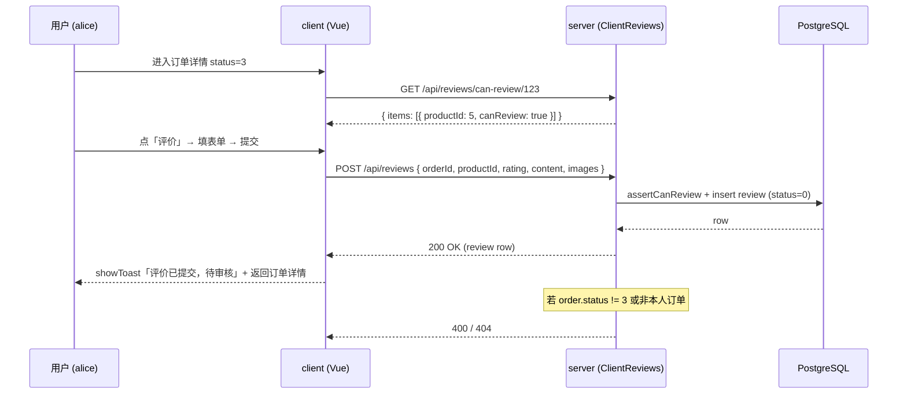
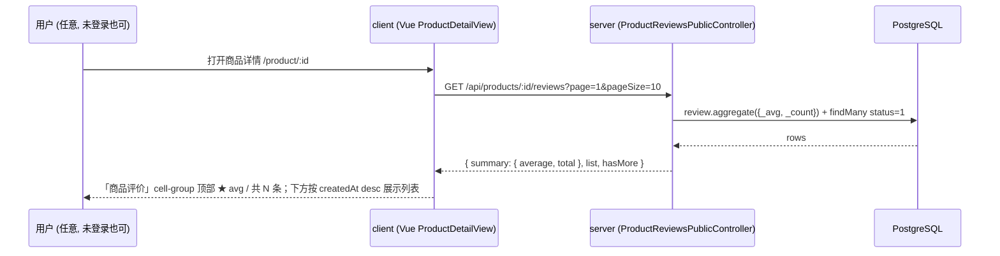
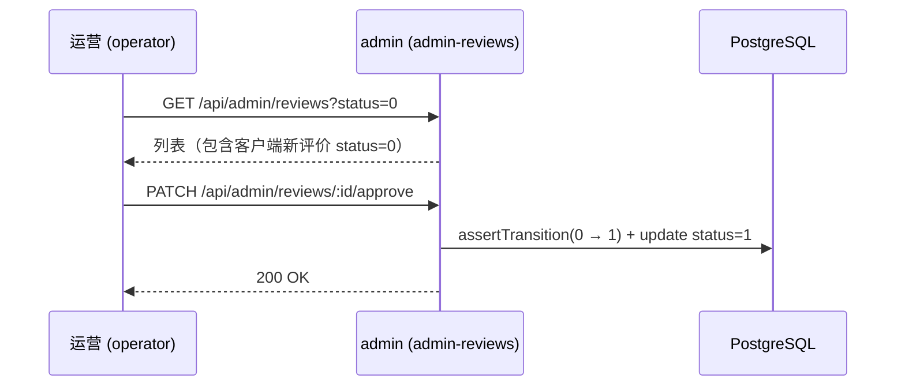

# 06 商品评价

> Phase 3 模块。前台用户在「已完成」订单内对每个商品提交 1~5 星 + 内容 + 图片（可选）的评价，
> 写入 `reviews` 表，默认 `status = 0` 待审，由 admin 端 `admin-reviews` 审核。
>
> 配套：服务端模块 `server/src/client-reviews/`；后台审核见 `docs/20-管理后台/10-评价管理.md`；
> 数据库 schema 见 `docs/10-服务端/03-数据库Schema说明.md`（§Review）。

## 1. 模块定位

- 入口：`OrderDetailView`（订单 `status=3` 时展示「评价『商品名』」按钮）→ `/review/create` 评价表单 → 提交后回订单详情
- 限制：每订单每商品仅 1 条（DB 唯一约束 `@@unique([orderId, productId])` 兜底）
- 写入状态：默认 `status = 0`（待审）；客户端暂不展示自己的评价状态机
- 不支持编辑 / 删除自己的评价；提交后归 admin 端管

## 2. 涉及数据表

- 复用 `reviews` 表（字段说明见 `docs/10-服务端/03-数据库Schema说明.md` §Review）
- Phase 3 新增唯一索引 `uniq_review_per_order_product`，对应迁移
  `prisma/migrations/20260912001000_phase3_review_unique/migration.sql`

## 3. Server 接口清单（`server/src/client-reviews/`）

| 方法 | 路径 | 鉴权 | 说明 |
| --- | --- | --- | --- |
| `POST` | `/api/reviews` | `JwtAuthGuard` | 创建评价（status 默认 0；DTO: `CreateReviewDto`） |
| `GET` | `/api/reviews/my` | `JwtAuthGuard` | 我的评价（按 `status` / 分页） |
| `GET` | `/api/reviews/can-review/:orderId` | `JwtAuthGuard` | 订单内每件商品的可评价状态（OrderDetailView 渲染「评价」按钮前调用） |

公开接口（`server/src/client-reviews/product-reviews-public.controller.ts`，不挂 `JwtAuthGuard`）：

| 方法 | 路径 | 鉴权 | 说明 |
| --- | --- | --- | --- |
| `GET` | `/api/products/:productId/reviews?page=&pageSize=` | 无（公开） | 商品已通过评价列表（status=1）+ 平均分聚合 |

需要登录的端点都走 `@UseGuards(JwtAuthGuard)` + `@CurrentUser()` 拿到当前用户，不接 `PermissionsGuard`
（前台登录用户即本人，不需要后台权限码体系）。

### 校验链

`POST /api/reviews` 必须同时满足：

1. `orderId` 归属当前 `userId`（不是本人订单 → `NotFoundException` 404）
2. `order.status === 3`（未完成 → `BadRequestException` 400）
3. `order.items` 包含 `productId`（订单里没这商品 → 400）
4. DB 唯一约束 `uniq_review_per_order_product` 兜底重复（Prisma `P2002` → 400「该订单商品已评价过」）

## 4. Client 路由与页面

| 路由 | 文件 | 说明 |
| --- | --- | --- |
| `/review/create` | `client/src/views/ReviewCreateView.vue` | 评价表单（van-rate + textarea + 图片 URL） |

API 封装：`client/src/api/review.ts`（与 `admin/src/api/admin-reviews.ts` 同风格）。

### `ReviewCreateView` 表单字段

- `orderId` / `productId`：路由 query 传入
- `rating`（1~5）：`van-rate`，默认 5 星
- `content`（必填，限 1000 字）：`van-field` 多行 textarea
- `images[]`（可选，最多 9 张）：演示版不做图片上传，用户粘贴 URL（与 admin-reviews 一致）

### `OrderDetailView` 改造

- 顶部 import 加 `getCanReview` + `listMyReviews` + `ReviewItem`
- `load()` 内当 `order.status === 3` 时并行拉 `getCanReview(orderId)` + `listMyReviews({ pageSize: 50 })`，按 `orderId` 自筛得 `myReviews`
- 底部 actions 区按 `order.items` 循环渲染「评价『商品名』」按钮，按 `itemCanReview(it.productId)` 显隐
- 路由跳转 `router.push({ name: 'review-create', query: { orderId, productId } })`
- 商品列表每个 item 下方展示「你的评价」block（评分 unicode + 内容 + 商家回复 / 待审核 / 已屏蔽 状态）

### `ProductDetailView` 改造（Phase 3 增补）

- 顶部 import 加 `listProductReviews` + `PublicReviewItem` + `ProductReviewSummary`
- `load()` 内并行拉 `getProduct(id)` + `listProductReviews(id, { page: 1, pageSize: 10 })`
- 在「商品介绍」下方插入「商品评价」`van-cell-group`：顶部展示 `★ {average} 共 {total} 条评价`；下面分页展示每条评价（用户昵称 + 评分 + 日期 + 内容 + 图片缩略图 + 商家回复）
- 仅当 `reviewSummary.total > 0` 时渲染该区域（无评价的商品不显示空区）

## 5. 关键流程

### 5.1 提交评价（mermaid）

### 5.2 商品详情展示评价（Phase 3 增补，公开）

### 5.3 后台审核（已存在，跨模块串联）

## 6. 权限点

- 前台接口走 `JwtAuthGuard`（登录态即本人），不需要 `PermissionsGuard` / 权限码
- 后台审核权限码：`review:list` / `review:detail` / `review:approve` / `review:block` / `review:reply`
  （已在 `server/prisma/seed.ts` 的 `ADMIN_PERMISSIONS` 中登记，AGENTS.md §4 速查表也已收录）

## 7. 演示版简化

- 不做图片上传，图片以 URL 数组存储（与 `admin-reviews` 一致，demo 用 `picsum.photos`）
- 不允许编辑 / 删除自己的评价；提交后归 admin 端管（状态机仍走 `REVIEW_TRANSITIONS`）
- 商品详情已展示评价列表 + 平均分（Phase 3 增补）；分页为前 10 条，后续可加分页加载更多
- 评价状态机完全复用 `server/src/admin-reviews/dto/review.dto.ts` 中的 `REVIEW_TRANSITIONS` / `REVIEW_STATUSES`

## 8. 关联

- 复用：`reviews` 表、`REVIEW_RATINGS` 常量、`REVIEW_STATUSES` 状态机
- 反向影响：
  - `docs/20-管理后台/10-评价管理.md` §0 / §1 / §3 / §7 / §8 同步更新
  - `docs/00-总览与入门/05-测试说明.md` §3 happy path + §5.2 表格新增「客户端提交评价」用例
- 测试：`docs/00-总览与入门/05-测试说明.md` §3.1 客户端主流程新增评价步骤

## 9. 相关文档

- 数据表结构：`10-服务端/03-数据库Schema说明.md`
- 后台审核：`20-管理后台/10-评价管理.md`
- 客户端主流程：`30-移动端/04-核心业务流程.md`
- 迁移 SQL：`server/prisma/migrations/20260912001000_phase3_review_unique/migration.sql`
